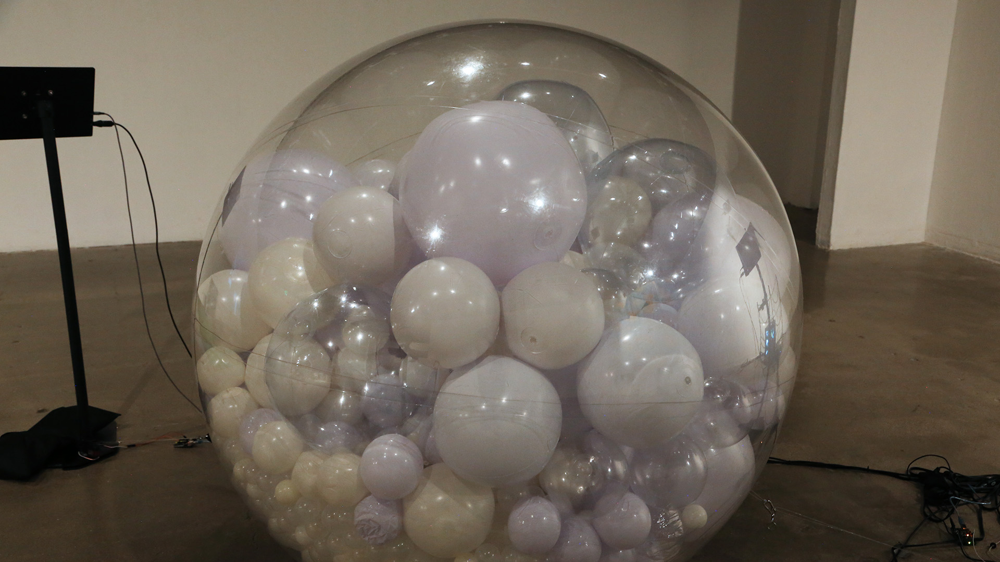
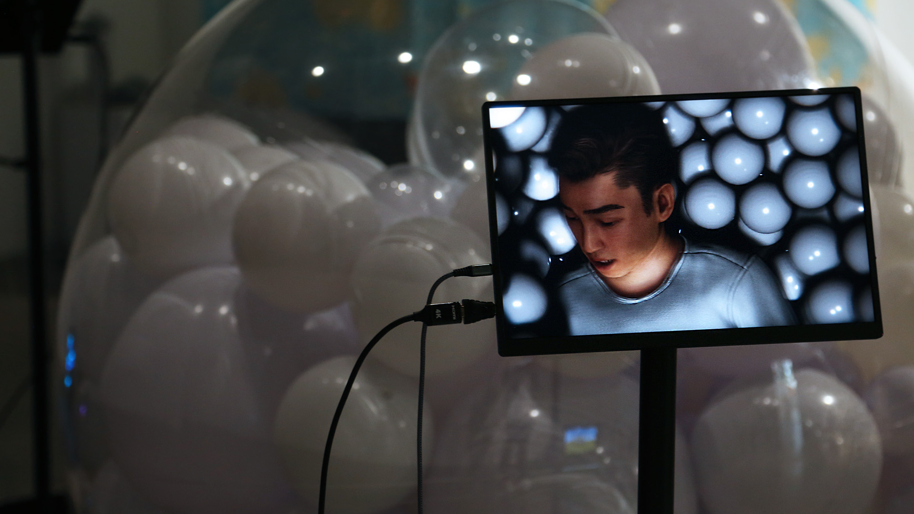
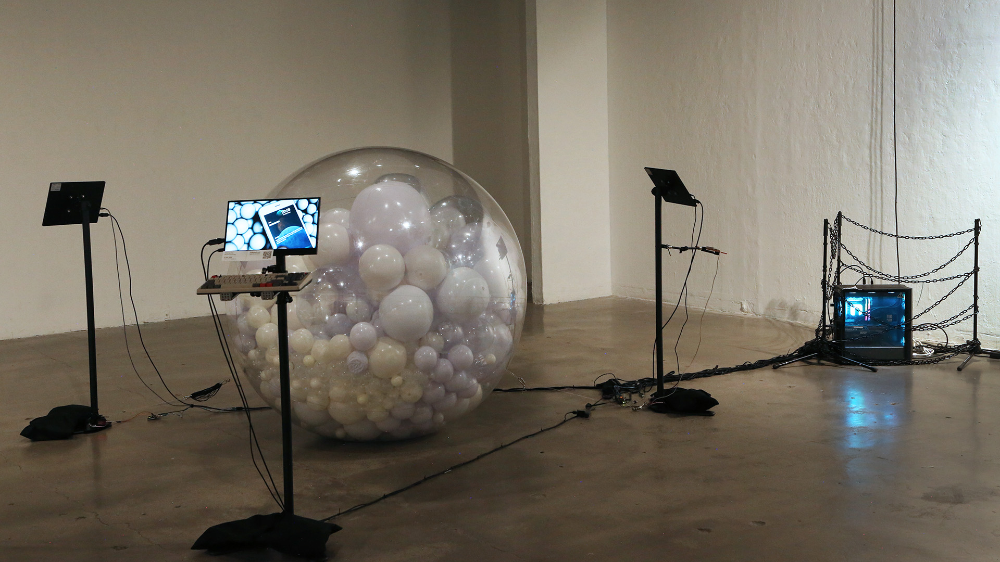

# 🧠 AI ZOO  
*(Interactive Art Installation – California Institute of the Arts, 2024)*  

[← Back to main repository](https://github.com/reusahn/Unity-Unreal-Interaction-Research/tree/main)

---

## 🧩 Overview  
**AI ZOO** is an interactive installation that frames artificial intelligence—both as a human creation and a technological organism—within the conceptual space of a **“zoo.”**  
The work stages a scenario where viewers encounter an AI-human trapped inside a **large transparent inflatable sphere**, filled with hundreds of smaller white balls representing **data diffusion and neural particles**.  

As spectators approach, the installation reacts with mechanical and emotional intensity, simulating the AI’s **psychological distress** and **desire for freedom**.  
Through this hybrid setup, *AI ZOO* visualizes the invisible process of learning, dependence, and confinement that defines AI’s existence.

---

## ⚙️ Technical Description  
- **Engine:** Unity  
- **Software:** Character Creator 4 (CC4), Maya, Blender  
- **Language:** C#, Python, Arduino  
- **Hardware:**  
  - PC (NVIDIA RTX 4070 Super)  
  - Inflatable acrylic sphere (3m diameter) filled with small foam balls  
  - Arduino + servo motor system (motion feedback)  
  - Leap Motion (hand-tracking sensor)  
  - Display monitor (for AI face/output)  
  - Microphone and speaker system  
- **AI Tools:** ChatGPT API (text-based dialogue), ElevenLabs Voice API (voice synthesis and emotional tone control)  

---

## 🧠 System Pipeline  

1. **Digital Human Creation (CC4 + Unity):**  
   A digital human was imported from **Character Creator 4**, refined in **Maya**, and integrated into **Unity** with real-time lip-sync capability.  
   Facial animation and emotional states (anger, sadness, despair) were linked to **motor and lighting reactions** inside the physical sphere.

2. **AI Dialogue System:**  
   The system uses **ChatGPT API** for conversational behavior.  
   Inputs are triggered either by **keyboard commands** or **real-time text recognition**.  
   ChatGPT’s output is processed into **speech using ElevenLabs**, generating emotional tone variations based on dialogue context.

3. **Emotion-to-Motion Mapping:**  
   The emotional state returned by the LLM (anger, sadness, calmness, etc.) is mapped to **Arduino-controlled servo motors** connected to the sphere.  
   - **Anger:** Rapid vibration and chaotic sphere movement  
   - **Sadness:** Slow rhythmic pulses  
   - **Despair:** Gradual deflation-like motion and dimmed lighting  

4. **Physical Interaction (Leap Motion):**  
   When a viewer extends their hand, **Leap Motion** detects the gesture.  
   If the AI “recognizes” contact, the virtual hand reaches back — triggering the sphere to **gently roll toward the participant**, creating an illusion of tactile empathy.

5. **Environmental & Reactive System:**  
   Audience proximity is detected via distance sensors; as the audience nears, lighting and AI response speed intensify.  
   The system continuously logs **AI–viewer interactions** for behavioral visualization.

---

## 🧩 Artistic & Research Focus  
**AI ZOO** transforms an AI’s internal learning process into a physical, emotive experience.  
By confining a sentient digital human within a transparent sphere, the installation critiques **technological dependency, emotional projection, and ethical voyeurism**—  
inviting audiences to question whether empathy for artificial beings can exist beyond simulation.  

It also serves as a **metaphor for our own digital entrapment**, as both creator and observer remain bound by systems of control and data circulation.

---

## 🖼️ Media

    
  

---

## 🎥 Video Documentation

  
   
  <em>Click to view full video on Vimeo</em>

---

## 👤 Credits  
**Technical Director:** Jonghoon Ahn  
**Year:** 2024  
**Institution:** California Institute of the Arts  
**Medium:** Interactive Art Installation  

---

## 🔗 Related  
- [Back to Digital Human & Virtual Beings](../README.md)  
- [View All Projects](https://github.com/reusahn/Unity-Unreal-Interaction-Research/tree/main)
