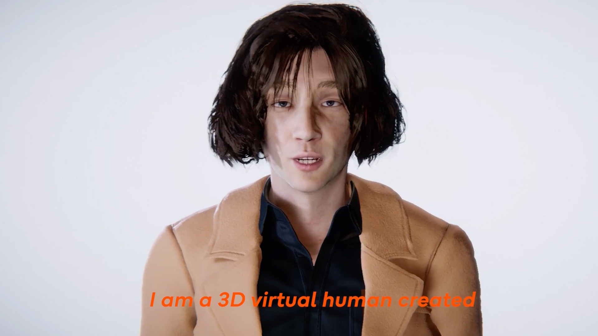
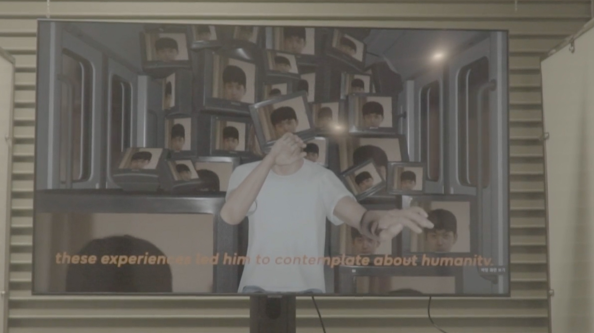
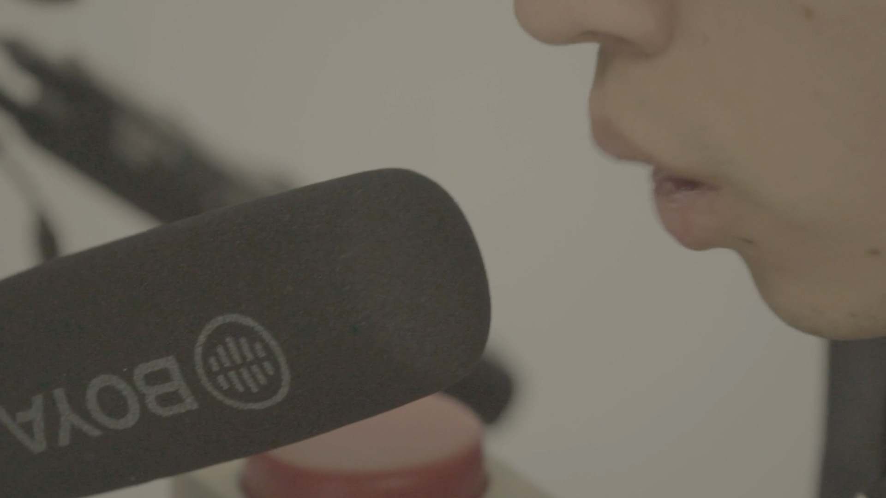

# 🎤 Choi Jung-hoon AI Human Research Project  
*(JANNABI AI Digital Human)*  

[← Back to main repository](https://github.com/reusahn/Unity-Unreal-Interaction-Research/tree/main)

---

## 🧠 Overview  
This research-based installation reconstructs **Choi Jung-hoon**, the lead vocalist of the Korean band **JANNABI**, as an AI-generated digital human.  
The project examines how identity, emotion, and authorship can be simulated through generative AI systems.  
A virtual Choi Jung-hoon engages in live conversation with viewers, responding in real time with his synthesized voice and mannerisms.  
It explores the emotional boundaries between admiration, replication, and authenticity within human–machine relationships.

---

## ⚙️ Technical Description  
- **Engine:** Unity  
- **Software:** Character Creator 4 (CC4), Headshot Plugin, Maya, Blender  
- **Language:** C#, Python  
- **AI Models:** OpenAI GPT (chat-based persona), ElevenLabs Voice Cloning API, diffusion-based texture synthesis  
- **Hardware:** Microphone, Azure Kinect, PC (NVIDIA RTX 4090)  

### 🧩 Pipeline  
1. **3D Reconstruction:**  
   Using reference photos of Choi Jung-hoon, a base model was generated in *CC4 Headshot Plugin* and detailed in *ZBrush*.  
   Hair was created using *CC4 Hair Builder*, and his outfit was recreated to match his on-stage wardrobe.  
2. **Voice Simulation:**  
   His voice was cloned using **ElevenLabs Fast Instant Voice Cloning**, trained through the artist’s interviews and performances.  
   The cloned model was integrated into Unity via ElevenLabs API for live TTS generation.  
3. **Personality & Dialogue:**  
   **ChatGPT API** was embedded in Unity, with an initial system prompt instructing the model to “behave and respond as Choi Jung-hoon.”  
   The LLM generated conversational responses in real time.  
4. **Audio–Visual Synchronization:**  
   Lip-sync was synchronized dynamically by analyzing the generated speech waveform.  
   A microphone input threshold controlled when the AI human detected and responded to user speech.  
5. **Audience Interaction:**  
   Using **Azure Kinect**, the digital human tracked and mimicked viewers’ body movements.  
   It also displayed **point cloud visualization**, showing how the AI perceives the human audience in its own vision system.  

---

## 🧩 Artistic & Research Focus  
The work reflects on **how AI and fans co-create identity**, transforming admiration into algorithmic embodiment.  
It questions whether a digital persona can express emotion, memory, or performance beyond imitation.  
By merging real-time AI conversation, motion sensing, and emotional mimicry, the project investigates **what it means to “meet” a synthetic human**.

---

## 🖼️ Media

  
  
  
  

---

## 🎥 Video Documentation

<!-- ✅ 백업: 깃허브에서 iframe이 차단될 때 표시될 썸네일 링크 -->

  
   
  <em>Click to view full video on Vimeo</em>

---

## 👤 Credits  
**Technical Director:** Jonghoon Ahn  
**Year:** 2024  
**Institution:** California Institute of the Arts  
**Medium:** Interactive Media Installation  

---

## 🔗 Related  
- [Back to Digital Human & Virtual Beings](../README.md)  
- [View All Projects](https://github.com/reusahn/Unity-Unreal-Interaction-Research/tree/main)
