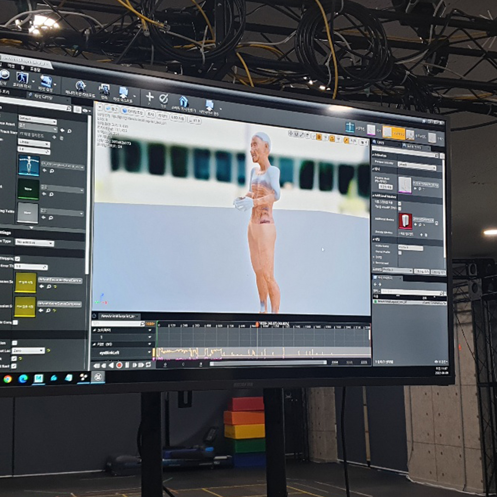
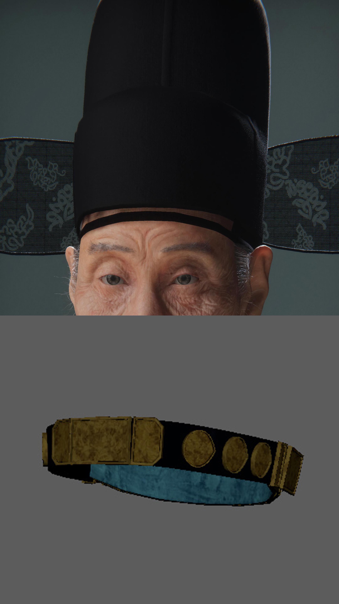

# 🧑‍🎨 Gang Se-hwang AI Docent  

[← Back to main repository](https://github.com/reusahn/Unity-Unreal-Interaction-Research/tree/main)

---

## 🧠 Overview  
**Gang Se-hwang AI Docent** is an interactive media installation that digitally revives **Gang Se-hwang** — the renowned painter and mentor to **Kim Hong-do** — as an **AI human**.  
Recreated through real-time interaction, Gang Se-hwang serves as a **docent at the Gyeonggi Provincial Museum**, guiding visitors through historical narratives and offering photo-taking experiences.  
The installation reimagines cultural memory through artificial intelligence, allowing audiences to meet and interact with a **digitally embodied scholar of the Joseon Dynasty** in a hybrid time-space.

---

## ⚙️ Technical Description  
The digital reconstruction was achieved through a **multi-stage pipeline** combining traditional 3D artistry, motion capture, and real-time systems:

---

### 1. Source Material Collection  
Archival portraits were provided by the **Gyeonggi Provincial Museum**, forming the basis for Gang Se-hwang’s visual reference.  

  
  

---

### 2. Voice and Performance Casting  
An actor with a **similar vocal tone and physical presence** was cast, and a **professional performer** was hired to embody the scholar’s gestures.  

---

### 3. Character Creation  
Using **reference images**, the likeness of Gang Se-hwang was **digitally sculpted in ZBrush**, then refined in **Maya** for **UV unwrapping and texturing**. **Normal maps** were generated to enhance fine surface details, while **facial hair and head hair** were created using **hair cards** for realistic rendering.    

  
  
  
  
  

---

### 4. Motion Capture  
- **Body motion** was recorded using the **OptiTrack system**.  
- **Facial motion** was captured through **Apple ARKit**, synchronizing expression and speech.  

  
    
      

---

### 5. Costume Simulation  
Traditional Korean attire — **hanbok**, **gat hat**, and layered robes — were modeled and simulated in **Blender** and **Maya**, achieving physically accurate fabric movement.  

  
   
    

---

### 6. Integration in Unity  
All assets were imported into **Unity 3D**, where interactive animation triggers (buttons, speech recognition, and audience proximity) were implemented.  

  
  

---

### 7. Installation Deployment  
The final AI docent was deployed at the **Gyeonggi Provincial Museum**, operating in real time as a responsive digital guide for visitors.  

  
  
    

---

## 🧩 Artistic & Research Focus  
This project explores **how historical identity and cultural heritage can be reinterpreted through digital embodiment**.  
By transforming Gang Se-hwang into an interactive AI docent, the work bridges **tradition and modern technology**, inviting audiences to reflect on the preservation of memory through artificial intelligence.

---

## 🖼️ Media  

    
  

---

## 🎥 Video Documentation  

  

---

## 👤 Credits  
**Technical Director:** Jonghoon Ahn  
**Title:** *Gang Se-hwang AI Docent*  
**Year:** 2022  
**Exhibition:** Gyeonggi Provincial Museum  
**Type:** Interactive Art Installation  

---

## 🔗 Related  
- [Back to Digital Human & Virtual Beings](../README.md)  
- [View All Projects](https://github.com/reusahn/Unity-Unreal-Interaction-Research/tree/main)
