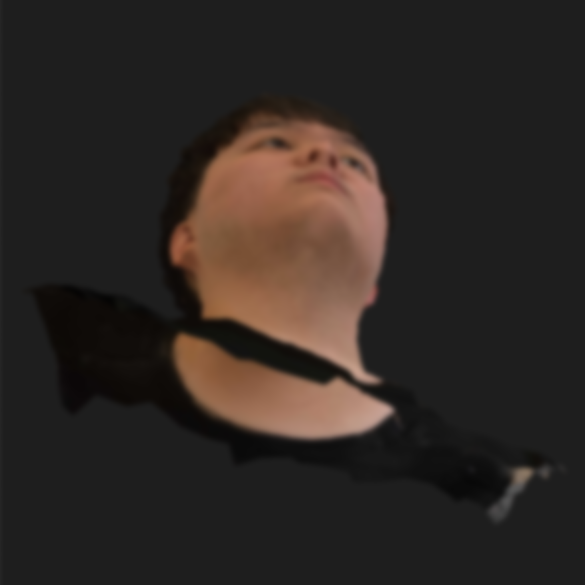
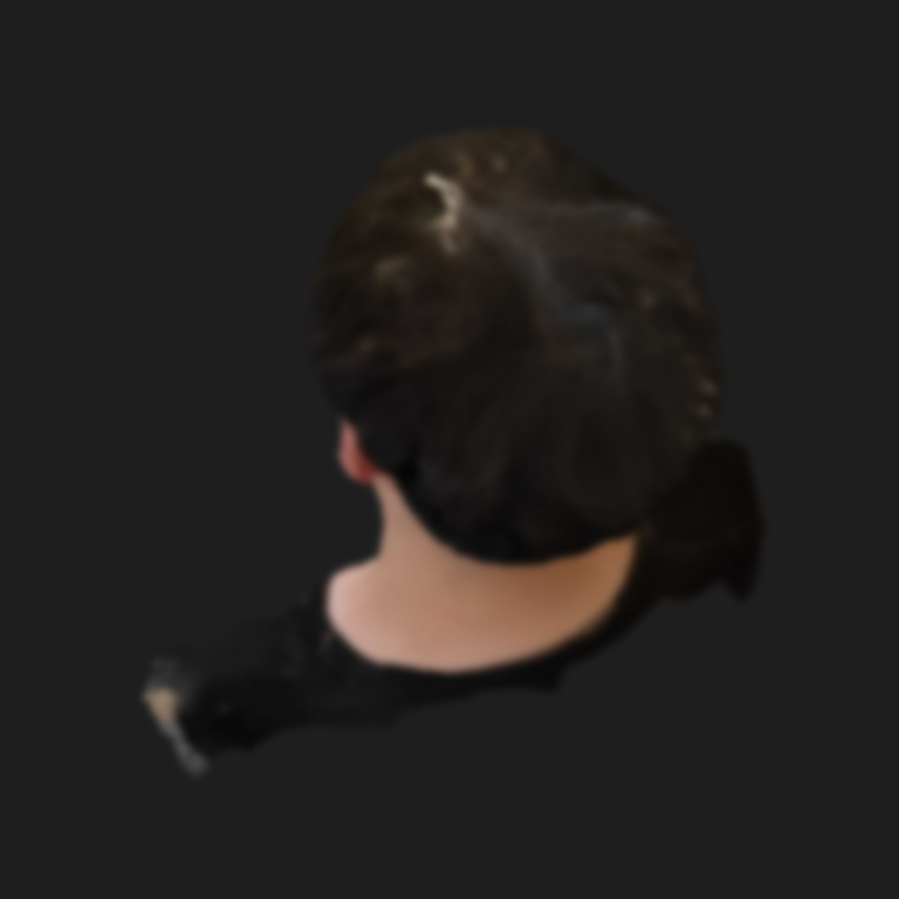
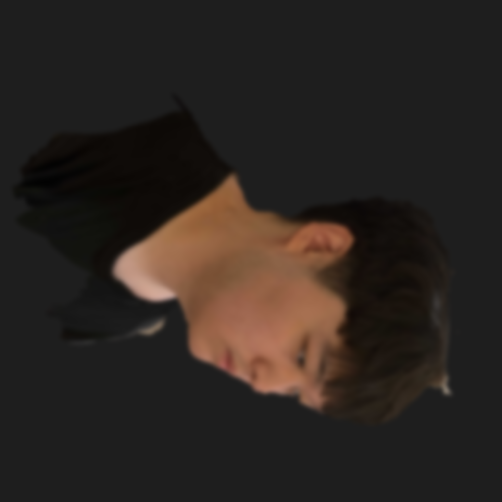
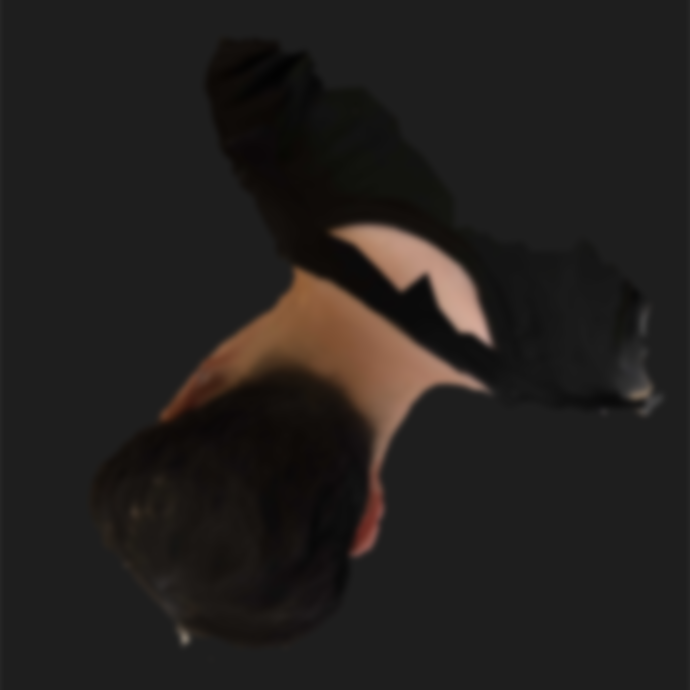
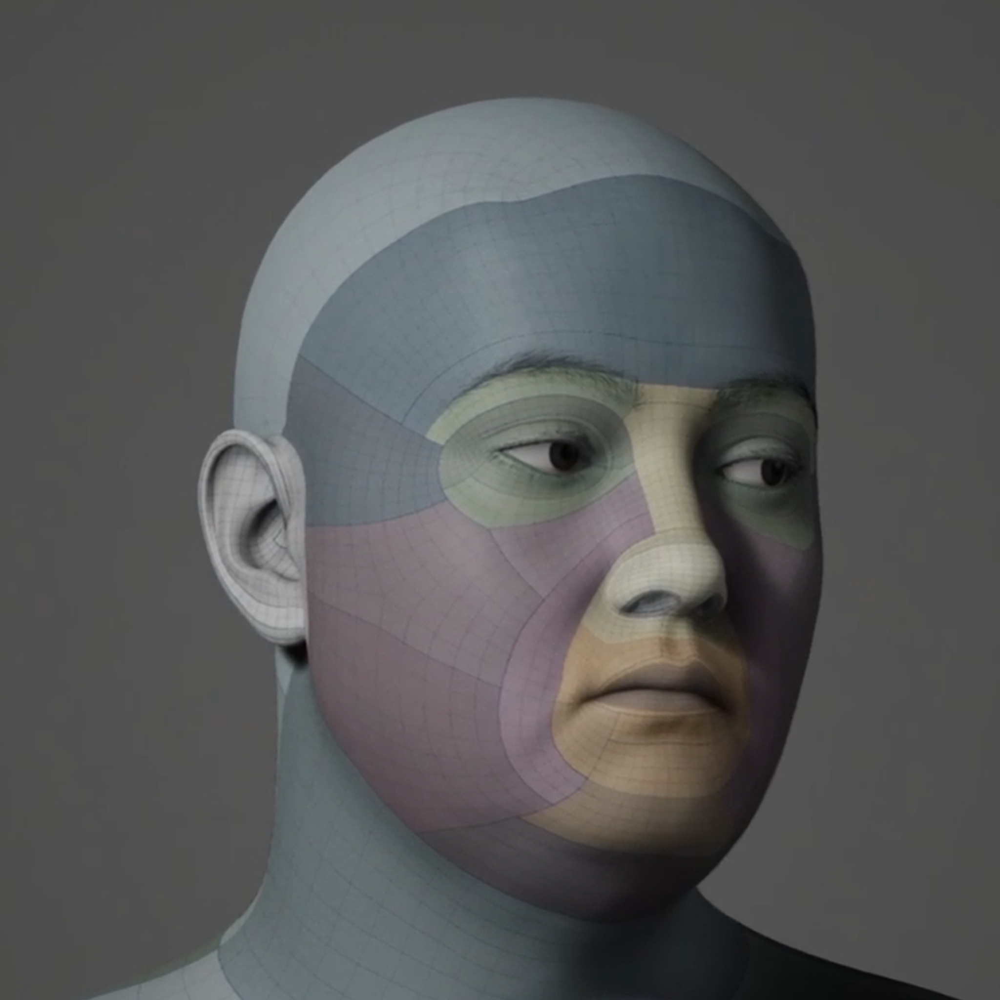
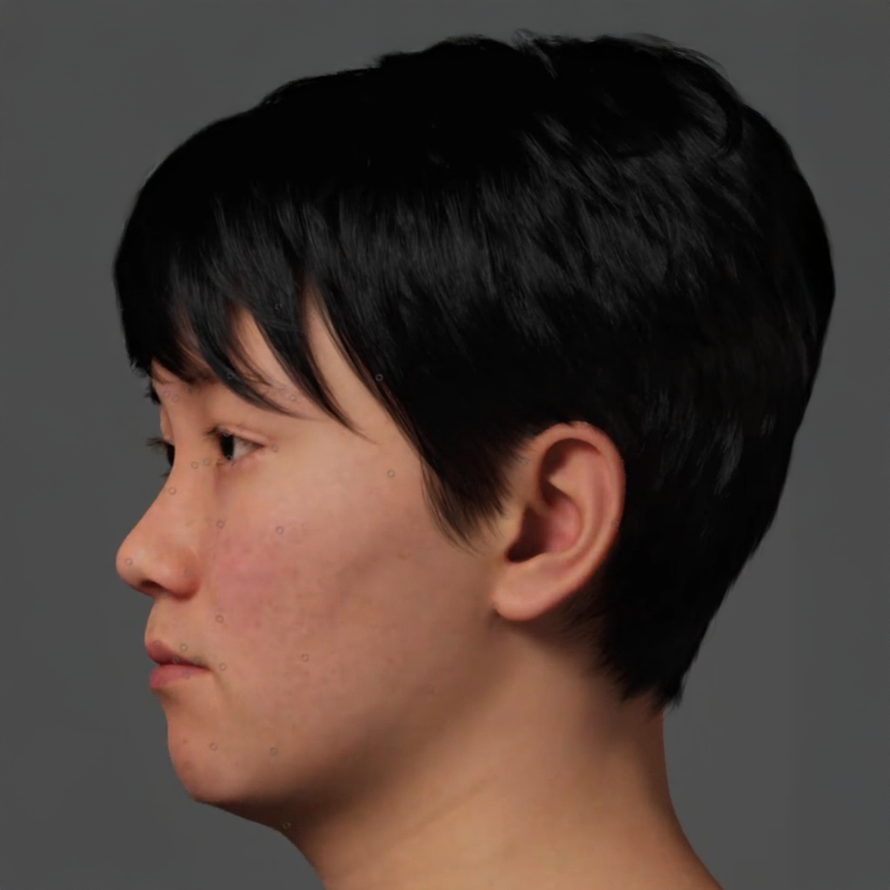
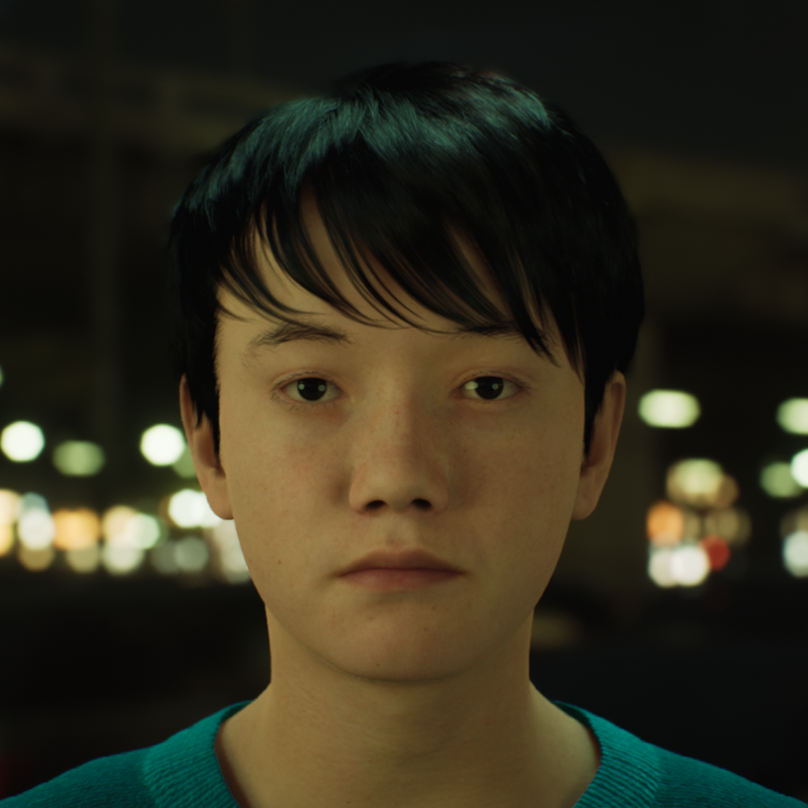
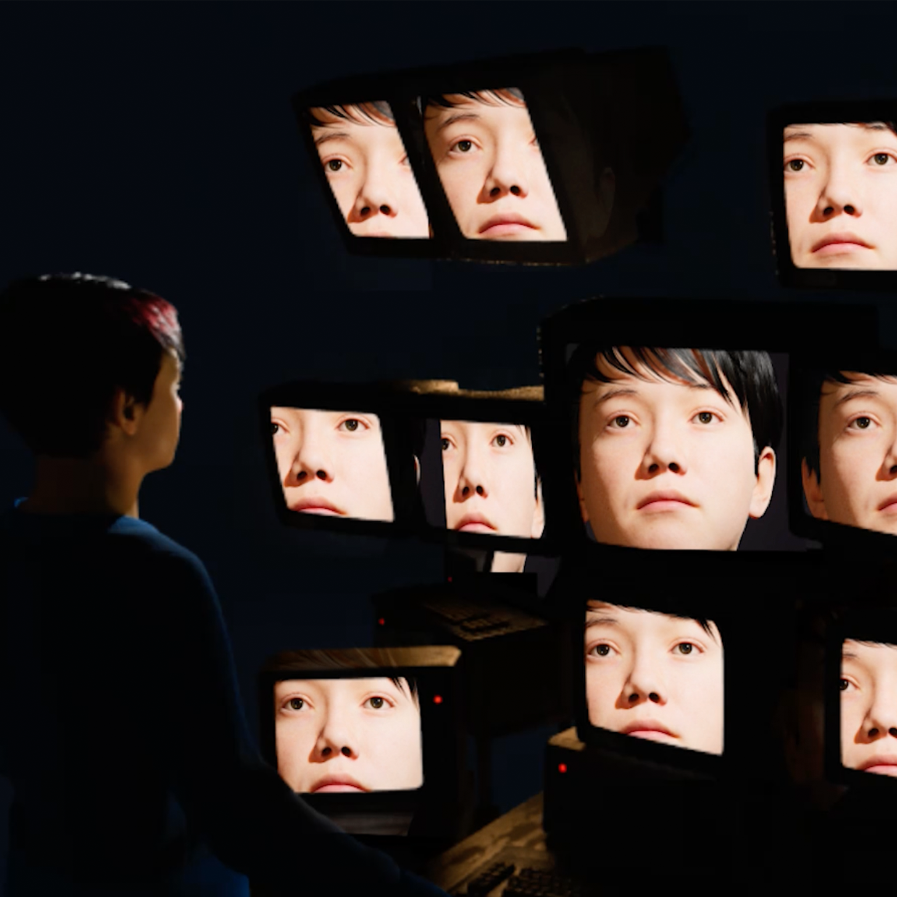

# From Representation To Empathy  
### Reconstructing Life through Digital Human
Exploring empathy, embodiment, and the perception of artificial life through 3D scanning, volumetric capture, motion data, and AI-driven characters. Each work questions how digital beings inherit emotion and agency from human creators.  
**Keywords:** Unity · Unreal Engine · Digital Human · Motion Capture · AI Simulation

---

### 🎬 Projects  
- [Gang Sehwang](./Works/Gang_Sehwang/README.md)  
- [Choi JungHoon (JANNABI AI)](./Works/Choi_JungHoon_JANNABI_AI/README.md)  
- [AI ZOO](./Works/AI_ZOO/README.md)  
- [Seon A’s Family](./Works/SeonA_Family/README.md)  
- [Whispers](./Works/Whispers/README.md)  
- [Yaloo Collaboration](./Works/Yaloo_Collaboration/README.md)  
- [Shininho](./Works/Shininho/README.md)  
- [Scott Collaboration](./Works/Scott_Collaboration/README.md)

---

## 🧩 Concept  
This series investigates how **digital embodiment** extends human memory, emotion, and identity into virtual spaces. Through AI-driven personas and responsive interactions, these projects explore how empathy emerges between human and synthetic life.

---

## 🧬 Research Narrative — From Replication to Empathy  

### I. Origin — Seeing Myself from the Outside  
I was born an **identical twin**. Since childhood, another version of me existed beside me — same face, same voice, same body. Instead of asking “Who am I?”, I often wondered, “Where do I end, and where does the other begin?” Watching my twin was like watching a mirror that sometimes refused to copy me. The small differences between us — gestures, reactions, expressions — became a way to study myself. That lifelong comparison became my first **experiment in self-reflection and identity**. When 3D technology and virtual platforms emerged, I asked another question:  
> “What would I look like inside the digital world?”  
I scanned my face and body and created my own **MetaHuman** inside Unreal Engine — a version of me that had only skin, no soul.  

    
    
    
    

Looking at that hollow copy, I felt not fear, but expansion. It allowed me to see myself from the outside — to become both subject and observer.  

    
    
    

From that moment, I began creating short conceptual videos about digital consciousness — stories of avatars searching for their own selves. Later, this digital twin became my **virtual collaborator**, and through it, I learned how to turn duplication into empathy.  

  <a href="https://vimeo.com/786792831">
     
    🎬 View documentation
  </a>

---

### II. Reconstructing Life through Digital Beings (Gang Sehwang)  
My first major work was **[Gang Sehwang](./Works/Gang_Sehwang/README.md)**, a digital resurrection of the 18th-century Korean painter. Using ZBrush and Maya, I reconstructed his body and gestures, allowing historical memory to inhabit a virtual form. It was not simply reproduction — it was a question: *Can cultural memory breathe again through digital flesh?* I called this process a kind of **digital reincarnation**.

    

---

### III. Emotion Meets Intelligence (JANNABI AI)  
Next came **[Choi JungHoon (JANNABI AI)](./Works/Choi_JungHoon_JANNABI_AI/README.md)**. While studying in the U.S., I missed home and the culture I came from. Out of admiration, I recreated a Korean musician as a digital human — but soon the project evolved into something deeper.  
> “What happens when human affection interacts with machine intelligence?”  
That question led me to explore how **emotion and cognition intertwine**, how obsession and empathy are mirrored through algorithms.

---

### IV. AI ZOO — The Mirror of Feeling  
This inquiry culminated in **[AI ZOO](./Works/AI_ZOO/README.md)**. I confined AI-generated humans inside transparent spheres, where they moved and reacted without realizing they were being watched. The audience observed them like living creatures — a study of empathy, voyeurism, and moral distance. The true experiment was not about whether AI could feel, but whether **humans could feel for it**. The glass walls revealed both the AI’s confinement and the limits of human empathy — how far compassion can extend beyond the biological.

---

### V. Seon A’s Family — Digital Mourning and Reconciliation  
This question turned inward in **[Seon A’s Family](./Works/SeonA_Family/README.md)**. In reality, my mother and sister were emotionally distant. In virtual space, I built a funeral room where their 3D-scanned figures could silently face one another. There were no words — only presence. The piece became a simulation of grief and reconciliation, a place where technology mediated what language could not. If in cinema I once used editing to create illusion, here I used **AI to deceive**, not to trick the mind but to expose how **deception and empathy coexist**.  
> “Are those deceived by AI naive, or simply more capable of empathy?”  
That paradox became the emotional core of my research — understanding how belief, illusion, and sensitivity shape the human response to simulation.

---

### VI. Yaloo Collaboration — Bodies Between Nature and Data  
Later I collaborated with the media artist **[Yaloo Collaboration](./Works/Yaloo_Collaboration/README.md)**. We scanned her body and created hybrid beings made of **seaweed and human skin**, merging organic ecology with digital identity. We also reconstructed her grandmother through 3D scanning and motion capture, revealing **digital immortality** — how memory and lineage continue through data. Through this, I realized that technology can become not only a tool of preservation but a **bridge across generations**.

---

### VII. Shininho — Regenerating Memory  
In **[Shininho](./Works/Shininho/README.md)**, we focused on reanimating Yaloo’s grandmother as a digital human. Using facial-capture, rigging, and AI-driven emotion synthesis, we transformed memory itself into data — a form of living remembrance.

---

### VIII. Scott Collaboration — Digital Afterlife and the Desire to Believe  
With **[Scott Collaboration](./Works/Scott_Collaboration/README.md)**, we created generative AI sculptures modeled on his late mother and ex-lover. When viewers approached, the figures responded in real time — a kind of digital séance. Though everyone knew they were artificial, many felt emotionally connected rather than sorrowful. They saw reflections of their own memories and relationships, and I realized something essential:  
> “People want to be deceived, because deception is sometimes the only way to meet the dead again.”

---

### IX. Toward a Psychology of Artificial Empathy  
Across these projects — from self-replication to historical resurrection, from emotional AI to digital mourning — my work has moved from **representation to empathy**, from the visible form to the **psychological resonance** between human and machine. I no longer create digital humans merely to resemble life, but to understand **how humans project life into the artificial**, and how machines, in turn, mirror our fears, desires, and capacity to feel. This practice lies at the intersection of **art, cognitive science, and emotional computation** — a field I call **Cyborg Psychology**, where memory, simulation, and empathy merge into one living interface.

---

> “Within every illusion we create lies a truth we are afraid to face. And within every machine we design lives the reflection of the human we are trying to forgive.”  
— *Jonghoon Ahn, 2025*

---

[← Back to Main Repository](https://github.com/reusahn/Unity-Unreal-Interaction-Research/tree/main)
