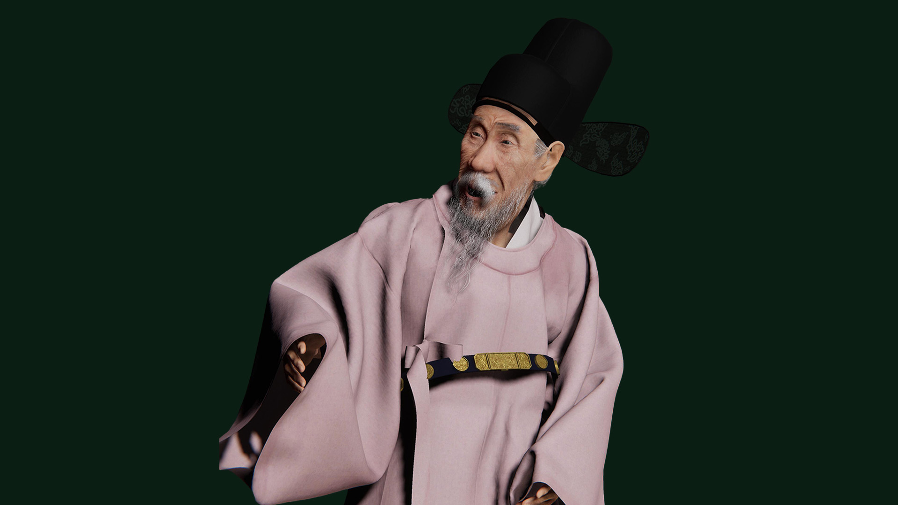
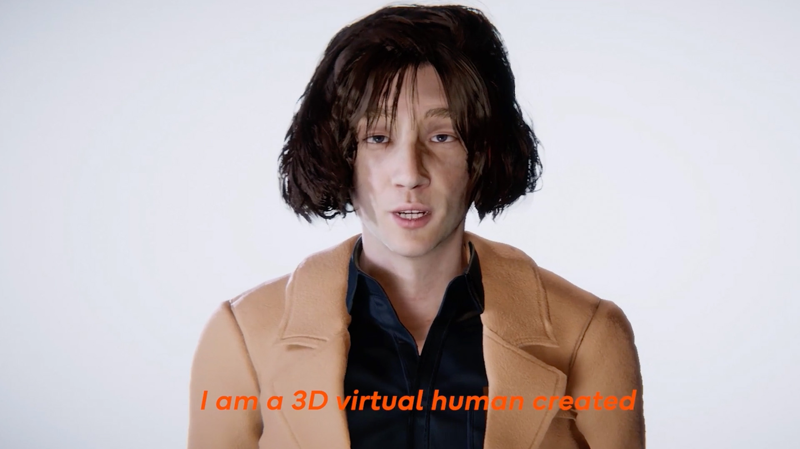
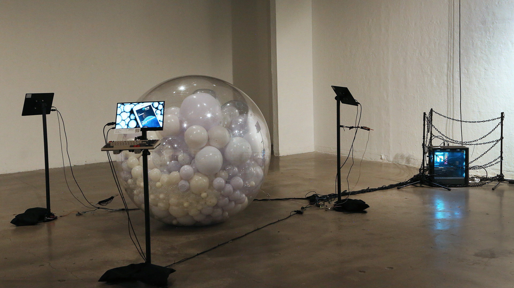
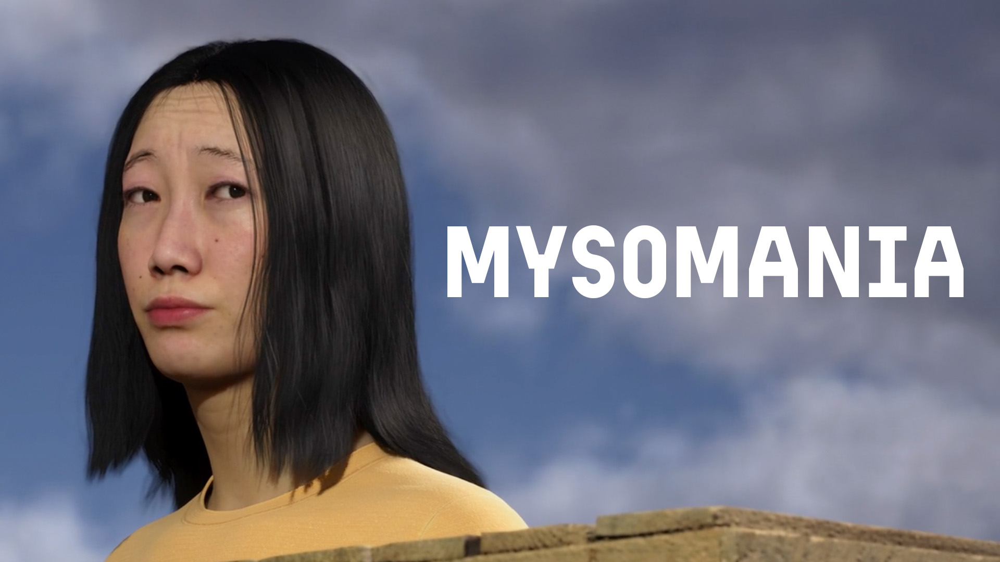
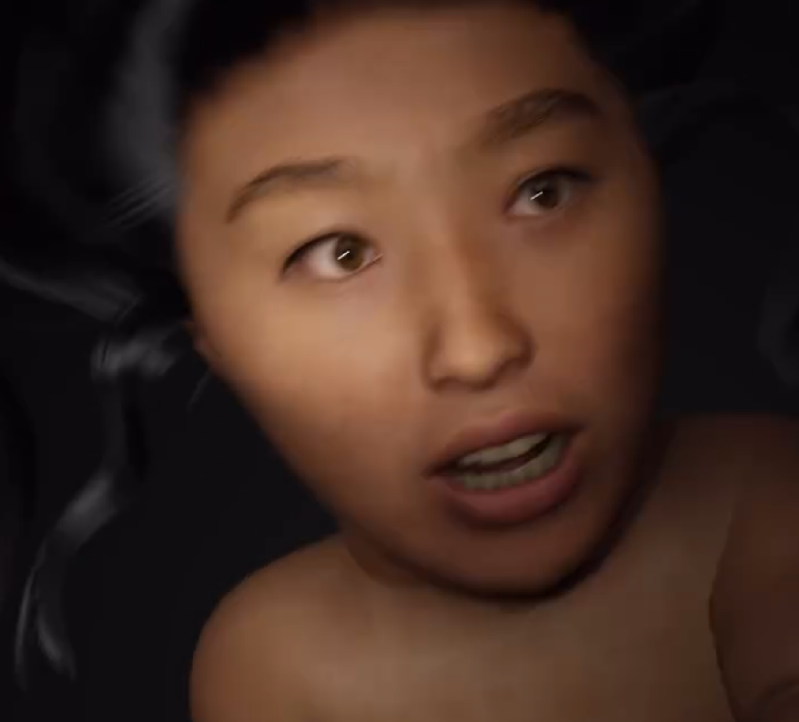
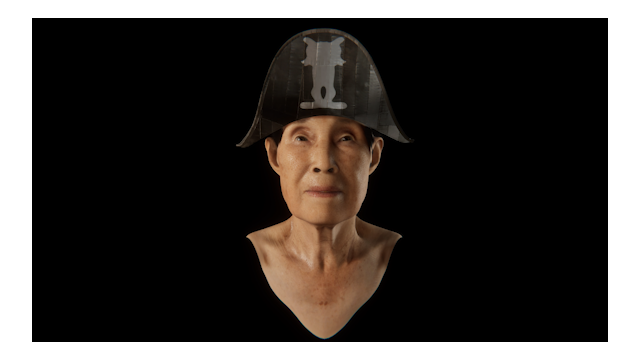
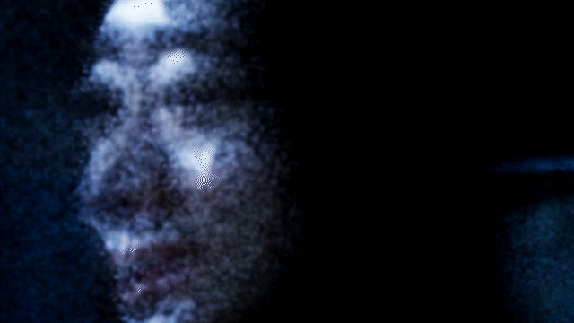

# From Representation To Empathy  
### Reconstructing Life through Digital Human
Exploring empathy, embodiment, and the perception of artificial life through 3D scanning, volumetric capture, motion data, and AI-driven characters. Each work questions how digital beings inherit emotion and agency from human creators.  
**Keywords:** Unity · Unreal Engine · Digital Human · Motion Capture · AI Simulation

---

### Toward a Psychology of Artificial Empathy  
My journey began with simple representation, reviving historical figures like Gang Se-hwang through digital reincarnation. When I moved to the United States, I recreated Choi Jung-hoon, the vocalist of the Korean band JANNABI, as a digital human. At first it was an act of admiration, a way to express fandom across distance, but it soon evolved into a deeper question: how does human emotion coexist with intelligent systems?

That question led to AI ZOO, where I confined digital humans inside transparent spheres and observed how audiences reacted to their emotions. Later, in Seon-a’s Family, I transformed my personal longing for reconciliation between my mother and sister, who were distant in real life, into a virtual funeral room. I imagined a space where affection might emerge more easily in simulation than in reality.

While filmmaking often uses illusion to manipulate emotion, this time I used AI itself to deceive the audience. Those who were deceived were not naive; they were the ones capable of feeling. It made me wonder whether being fooled by artificial emotion reveals a lack of intelligence or a surplus of empathy. To feel for something unreal may not mean weakness, but humanity.

This became the center of my research. I began to see deception as a mirror of belief. Through collaborations with Yaloo, I created hybrid posthuman bodies, merging her form with seaweed and reconstructing her grandmother through 3D scanning and motion capture. These projects explored the idea of digital immortality and the continuation of affection through data. With Scott, I re-created his late mother and ex-lover as generative AI sculptures that responded to audiences in real time, allowing death and simulation to momentarily coexist.

We know these beings are not real, yet we choose to believe, because belief itself becomes the last bridge to what we have lost. Perhaps we need illusion, because only through it can we meet those who are gone.

In the age of AGI we all become children again, unable to tell what is true or false, real or artificial. But to remain human is to keep questioning, even when the illusion feels real.

When that time comes, I hope we can live alongside our cyborg reflections not with fear but with understanding, finding within their artificial portraits the strength to see ourselves more clearly.

---

## 🧩 Concept  
This series investigates how **digital embodiment** extends human memory, emotion, and identity into virtual spaces. Through AI-driven personas and responsive interactions, these projects explore how empathy emerges between human and synthetic life.

---

## 🧬 Research Narrative — From Replication to Empathy  

### Ⅰ. Origin — Seeing Myself from the Outside  
I was born an **identical twin**. Since childhood, another version of me existed beside me — same face, same voice, same body. Instead of asking “Who am I?”, I often wondered, “Where do I end, and where does the other begin?” Watching my twin was like watching a mirror that sometimes refused to copy me. The small differences between us — gestures, reactions, expressions — became a way to study myself. That lifelong comparison became my first **experiment in self-reflection and identity**. When 3D technology and virtual platforms emerged, I asked another question:  
> “What would I look like inside the digital world?”  
I scanned my face and body and created my own **MetaHuman** inside Unreal Engine — a version of me that had only skin, no soul.  

    
    
    
    

Looking at that hollow copy, I felt not fear, but expansion. It allowed me to see myself from the outside — to become both subject and observer.  

    
    
    

From that moment, I began creating short conceptual videos about digital consciousness — stories of avatars searching for their own selves. Later, this digital twin became my **virtual collaborator**, and through it, I learned how to turn duplication into empathy.  

  <a href="https://vimeo.com/786792831">
     
    🎬 View documentation
  </a>

---

### Ⅱ. Reconstructing Life through Digital Beings *(Gang Sehwang)*  
My first major work was **[Gang Sehwang](./Works/Gang_Sehwang/README.md)**, a digital resurrection of the 18th-century Korean painter. Using ZBrush and Maya, I reconstructed his body and gestures, allowing historical memory to inhabit a virtual form. It was not simply reproduction — it was a question: *Can cultural memory breathe again through digital flesh?* I called this process a kind of **digital reincarnation**.  

  

---

### Ⅲ. Emotion Meets Intelligence *(JANNABI AI)*  
Next came **[Choi JungHoon (JANNABI AI)](./Works/Choi_JungHoon_JANNABI_AI/README.md)**. While studying in the U.S., I missed home and the culture I came from. Out of admiration, I recreated a Korean musician as a digital human — but soon the project evolved into something deeper.  
> “What happens when human affection interacts with machine intelligence?”  
That question led me to explore how **emotion and cognition intertwine**, how obsession and empathy are mirrored through algorithms.  

  

---

### Ⅳ. AI ZOO — The Mirror of Feeling  
This inquiry culminated in **[AI ZOO](./Works/AI_ZOO/README.md)**. I confined AI-generated humans inside transparent spheres, where they moved and reacted without realizing they were being watched. The audience observed them like living creatures — a study of empathy, voyeurism, and moral distance. The true experiment was not about whether AI could feel, but whether **humans could feel for it**.  

  

---

### Ⅴ. Seon A’s Family — Digital Mourning and Reconciliation  
This question turned inward in **[Seon A’s Family](./Works/SeonA_Family/README.md)**. In reality, my mother and sister were emotionally distant. In virtual space, I built a funeral room where their 3D-scanned figures could silently face one another. There were no words — only presence. The piece became a simulation of grief and reconciliation, a place where technology mediated what language could not.  

  

---

### Ⅵ. Whispers – Mythomania — Storytelling with AI  
**[Whispers – Mythomania](./Works/Whispers/README.md)** expands upon the ideas first explored in *Whispers*,  
focusing on **collaborative storytelling between human and artificial intelligence**.  
In this project, I co-directed the film with AI, allowing narrative direction, dialogue, and pacing to evolve through ongoing exchanges between us.  

The story follows three strangers adrift on a raft, forced to confront their past guilt as silence and hunger consume them.  
AI participated not only as a writing assistant but as a **creative counterpart**,  
suggesting structural patterns, emotional beats, and symbolic motifs that shaped the screenplay.  

Through this process, authorship became shared —  
a reflection of two consciousnesses, human and synthetic, co-narrating a single emotional vision.  

  

At its heart, *Whispers – Mythomania* is about **trusting another kind of intelligence**.  
It asks: *Can empathy exist not only within a story but between the beings who create it — even when one of them is artificial?*

---

### Ⅶ. Yaloo Collaboration — Bodies Between Nature and Data  
Later I collaborated with the media artist **[Yaloo Collaboration](./Works/Yaloo_Collaboration/README.md)**. We scanned her body and created hybrid beings made of **seaweed and human skin**, merging organic ecology with digital identity. We also reconstructed her grandmother through 3D scanning and motion capture, revealing **digital immortality** — how memory and lineage continue through data.  

  

---

### Ⅷ. Shininho — Regenerating Memory  
In **[Shininho](./Works/Shininho/README.md)**, we focused on reanimating Yaloo’s grandmother as a digital human. Using facial-capture, rigging, and AI-driven emotion synthesis, we transformed memory itself into data — a form of living remembrance.  

  

---

### Ⅸ. Scott Collaboration — Digital Afterlife and the Desire to Believe  
With **[Scott Collaboration](./Works/Scott_Collaboration/README.md)**, we created generative AI sculptures modeled on his late mother and ex-lover. When viewers approached, the figures responded in real time — a kind of digital séance. Though everyone knew they were artificial, many felt emotionally connected rather than sorrowful.  

  

---

<!--
### Ⅹ. Toward a Psychology of Artificial Empathy  
My journey began with simple representation, reviving historical figures like Gang Se-hwang through digital reincarnation. When I moved to the United States, I recreated Choi Jung-hoon, the vocalist of the Korean band JANNABI, as a digital human. At first it was an act of admiration, a way to express fandom across distance, but it soon evolved into a deeper question: how does human emotion coexist with intelligent systems?

That question led to AI ZOO, where I confined digital humans inside transparent spheres and observed how audiences reacted to their emotions. Later, in Seon-a’s Family, I transformed my personal longing for reconciliation between my mother and sister, who were distant in real life, into a virtual funeral room. I imagined a space where affection might emerge more easily in simulation than in reality.

While filmmaking often uses illusion to manipulate emotion, this time I used AI itself to deceive the audience. Those who were deceived were not naive; they were the ones capable of feeling. It made me wonder whether being fooled by artificial emotion reveals a lack of intelligence or a surplus of empathy. To feel for something unreal may not mean weakness, but humanity.

This became the center of my research. I began to see deception as a mirror of belief. Through collaborations with Yaloo, I created hybrid posthuman bodies, merging her form with seaweed and reconstructing her grandmother through 3D scanning and motion capture. These projects explored the idea of digital immortality and the continuation of affection through data. With Scott, I re-created his late mother and ex-lover as generative AI sculptures that responded to audiences in real time, allowing death and simulation to momentarily coexist.

We know these beings are not real, yet we choose to believe, because belief itself becomes the last bridge to what we have lost. Perhaps we need illusion, because only through it can we meet those who are gone.

In the age of AGI we all become children again, unable to tell what is true or false, real or artificial. But to remain human is to keep questioning, even when the illusion feels real.

When that time comes, I hope we can live alongside our cyborg reflections not with fear but with understanding, finding within their artificial portraits the strength to see ourselves more clearly.

---
-->

> “In the age of AGI we all become children again, unable to tell what is true or false, real or artificial.   
> But to remain human is to keep questioning, even when the illusion feels real.”  
>
> *Jonghoon Ahn, 2025*

---

### 🎬 Projects  
- [Gang Sehwang](./Works/Gang_Sehwang/README.md)  
- [Choi JungHoon (JANNABI AI)](./Works/Choi_JungHoon_JANNABI_AI/README.md)  
- [AI ZOO](./Works/AI_ZOO/README.md)  
- [Seon A’s Family](./Works/SeonA_Family/README.md)  
- [Whispers](./Works/Whispers/README.md)  
- [Yaloo Collaboration](./Works/Yaloo_Collaboration/README.md)  
- [Shininho](./Works/Shininho/README.md)  
- [Scott Collaboration](./Works/Scott_Collaboration/README.md)

---

[← Back to Main Repository](https://github.com/reusahn/Unity-Unreal-Interaction-Research/tree/main)
