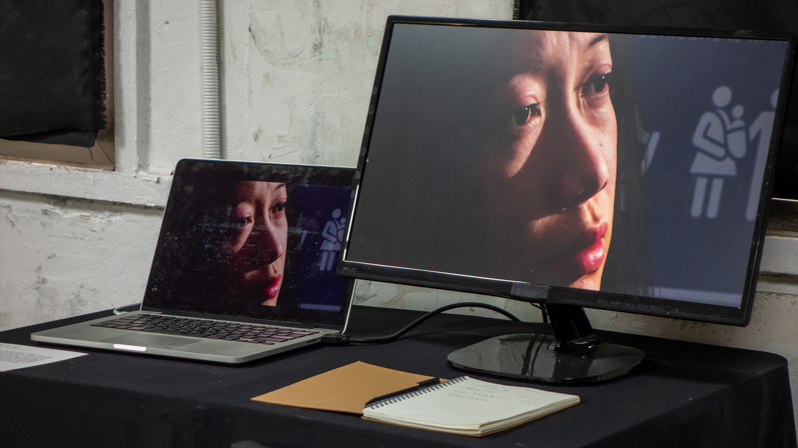
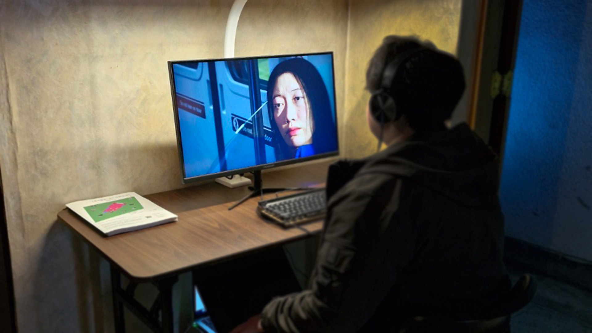
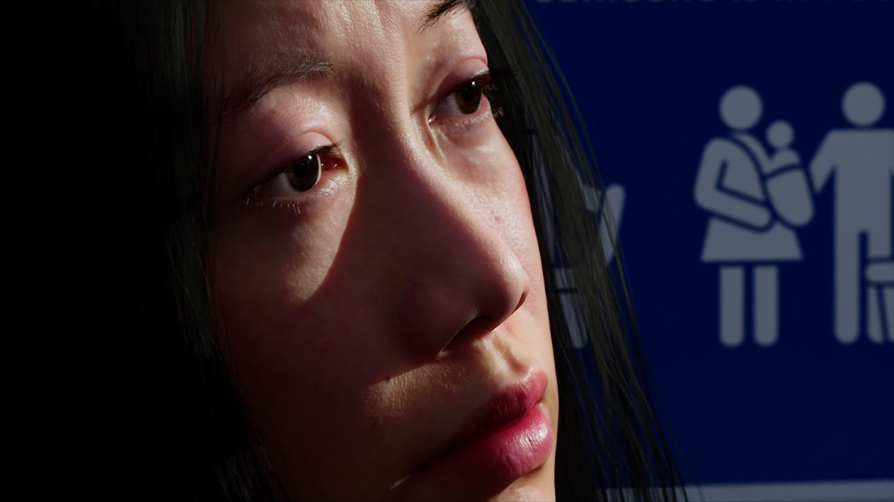

# 🕊️ Seon-a’s Family  
*(Media Art Project 5 – 2024 · KOTE Gallery (Insadong) & Wolseong Yakbang)*  

[← Back to main repository](https://github.com/reusahn/Unity-Unreal-Interaction-Research/tree/main)

---

## 🧩 Overview  
**Seon-a’s Family** is a storytelling-based media artwork that explores **familial conflict and reconciliation** through advanced digital technologies.  
By integrating **diffusion models**, **large language models (LLMs)**, and **digital human systems**, Seon-a’s journey unfolds across multiple layers of time and space, transcending traditional linear narrative conventions.  

Viewers are invited to interactively engage with her story, embracing new modes of **digital storytelling and emotional immersion**.  
Blending emotional depth with technical precision, the work reflects on the **harmony and tension between human relationships and emerging technologies**.

---

## ⚙️ Technical Description  
- **Engine:** Unity  
- **Software:** Maya · Blender  
- **Language:** C# · Python  
- **AI Models:** Diffusion Model · LLM (ChatGPT API integration) · Facial and motion synthesis  
- **Hardware:** PC (NVIDIA RTX 4090), Display Screen, Audio System  
- **Pipeline:**  
  1. Narrative dataset training and prompt-driven text generation  
  2. Digital human creation through 3D scanning and facial capture  
  3. Diffusion visual synthesis for memory and dream sequences  
  4. Interactive timeline integration in Unity using custom UI logic  
  5. Real-time rendering and projection for exhibition environments  

---

## 🧠 Artistic & Research Focus  
The project investigates **how AI technologies reshape human memory and emotion**, focusing on the emotional architecture of family dynamics.  
It examines the potential of **digital humans as narrative mediums** and proposes new temporal structures that merge personal history with machine imagination.  

---

## 🖼️ Media

    
  

---

## 🎥 Video Documentation

  

---

## 👤 Credits  
**Director / Technical Artist:** Jonghoon Ahn  
**Year:** 2024  
**Institution:** California Institute of the Arts  
**Medium:** Single Channel Video · Interactive Media Installation  

---

## 🔗 Related  
- [Back to Digital Human & Virtual Beings](../README.md)  
- [View All Projects](https://github.com/reusahn/Unity-Unreal-Interaction-Research/tree/main)

