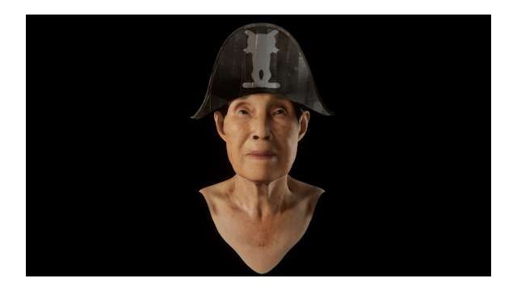

# 👵 Shin Inho – Digital Human Reconstruction  
*(Volumetric Memory & Digital Heritage Project – 2024)*  

[← Back to main repository](https://github.com/reusahn/Unity-Unreal-Interaction-Research/tree/main)

---

## 🧩 Overview  
**Shin Inho** is a digital human reconstruction project that revives **Yaloo’s late grandmother** through volumetric capture and AI-driven animation.  
Using **3D scanning, high-resolution texturing, and procedural motion synthesis**, the project transfers a human presence into digital form—  
exploring the boundary between technological preservation and emotional memory.  

The reconstructed grandmother moves and emotes through subtle gestures generated by artificial intelligence.  
She exists both as **a dataset and a human presence**, evoking a quiet moment of reunion that merges affection, remembrance, and computation.

---

## ⚙️ Technical Description  
- **Engines:** Unity · Unreal Engine 5  
- **Software:** Maya · Blender · Marvelous Designer  
- **Language:** C# · Python  
- **Hardware:** Volumetric 3D Scanner · PC (NVIDIA RTX 4090)  
- **Pipeline:**  
  1. Volumetric 3D scan for high-fidelity mesh and texture capture  
  2. Retopology, rigging, and material reconstruction in Maya and Blender  
  3. AI-based motion generation and expression blending  
  4. Cloth simulation using Marvelous Designer for traditional garments  
  5. Real-time rendering in Unity and Unreal for exhibition playback  

---

## 🧠 Artistic & Research Focus  
This work investigates **digital resurrection and emotional authenticity** in the context of human–machine preservation.  
By transforming an intimate familial presence into a digital human, **Shin Inho** explores how technology can embody memory without replacing it.  
The project asks whether **data can remember love**—and what remains of humanity when affection becomes algorithmic.  

---

## 🖼️ Media

    
  

---

## 🎥 Video Documentation

  

---

## 👤 Credits  
**Collaborating Artist:** Yaloo 
**Technical Director:** Jonghoon Ahn   
**Year:** 2025  
**Institution:** California Institute of the Arts  
**Medium:** Digital Human Reconstruction  

---

## 🔗 Related  
- [Back to Digital Human & Virtual Beings](../README.md)  
- [View All Projects](https://github.com/reusahn/Unity-Unreal-Interaction-Research/tree/main)
