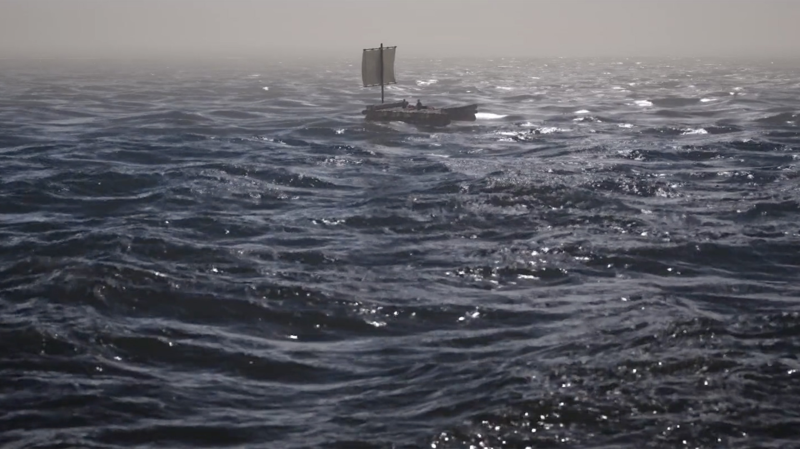
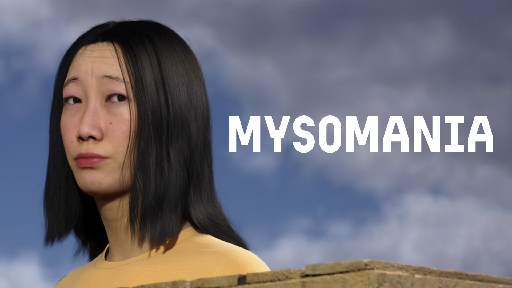

# 🌊 Whispers-Mysomania  
*(3D Short Film – 2024)*  

[← Back to main repository](https://github.com/reusahn/Unity-Unreal-Interaction-Research/tree/main)

---

## 🧩 Overview  
**Mysomania** is a 3D short film exploring **guilt, survival, and moral decay** through psychological metaphor.  
Three strangers awaken on a drifting raft, with no memory of how they arrived.  
As they share mysterious meat to survive, silence begins to unravel their deepest guilt—  
and those who attempt to justify their past actions gradually disappear, one by one.  

The film employs **minimal dialogue, symbolic imagery, and surreal atmosphere** to examine the boundary between human instinct and ethical collapse.

---

## ⚙️ Technical Description  
- **Engine:** Unreal Engine 5  
- **Software:** Maya · Blender · Substance Painter  
- **Language:** Blueprint · Python (for simulation tools)  
- **Hardware:** PC (NVIDIA RTX 4090)  
- **Pipeline:**  
  1. Storyboarding and previsualization using Unreal Sequencer  
  2. Character modeling, rigging, and animation in Maya and Blender  
  3. Ocean simulation and lighting setup using Unreal Water System  
  4. Rendering with Lumen and Path Tracing for cinematic realism  
  5. Sound design and post-production in DaVinci Resolve and Reaper  

---

## 🧠 Artistic & Research Focus  
The project explores **silence as narrative structure** and **ethical fragmentation in isolated environments**.  
By abstracting human guilt into symbolic space, **Mysomania** visualizes the collapse of moral communication and the psychological distance between survival and empathy.  

---

## 🖼️ Media

    
  

---

## 🎥 Video Documentation

  

---

## 👤 Credits  
**Director / Technical Artist:** Jonghoon Ahn  
**Year:** 2024  
**Institution:** California Institute of the Arts  
**Medium:** 3D Short Film  

---

## 🔗 Related  
- [Back to Digital Human & Virtual Beings](../README.md)  
- [View All Projects](https://github.com/reusahn/Unity-Unreal-Interaction-Research/tree/main)

