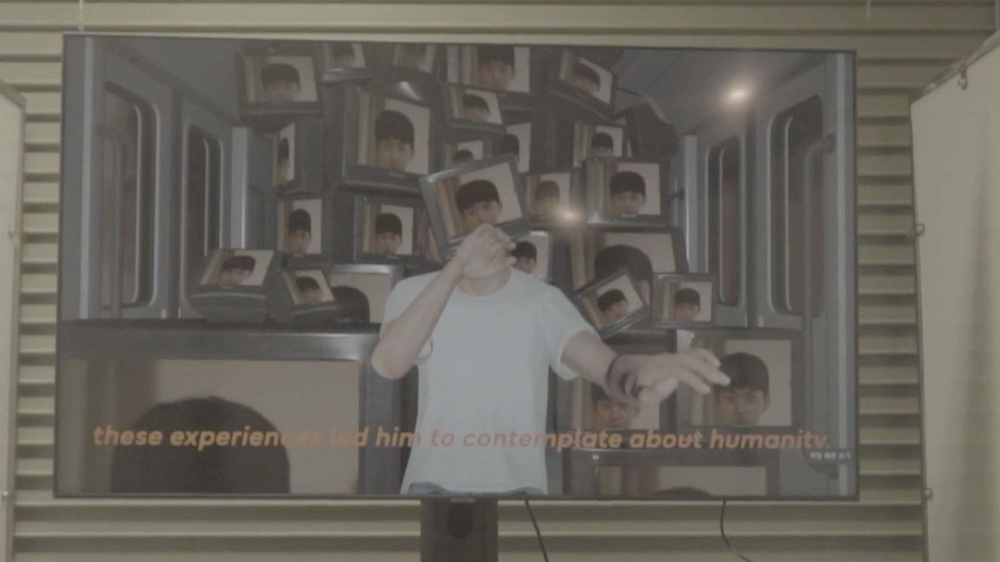
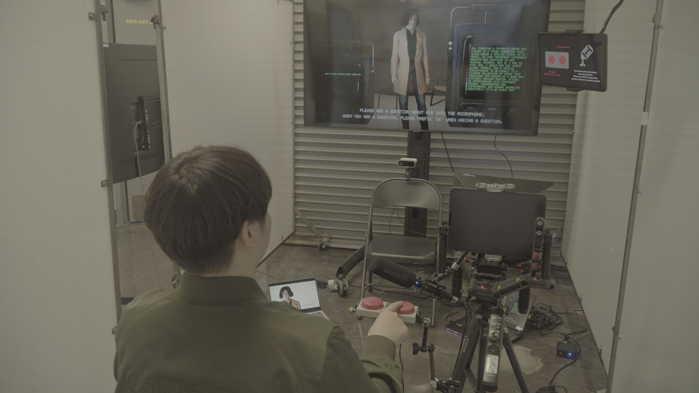
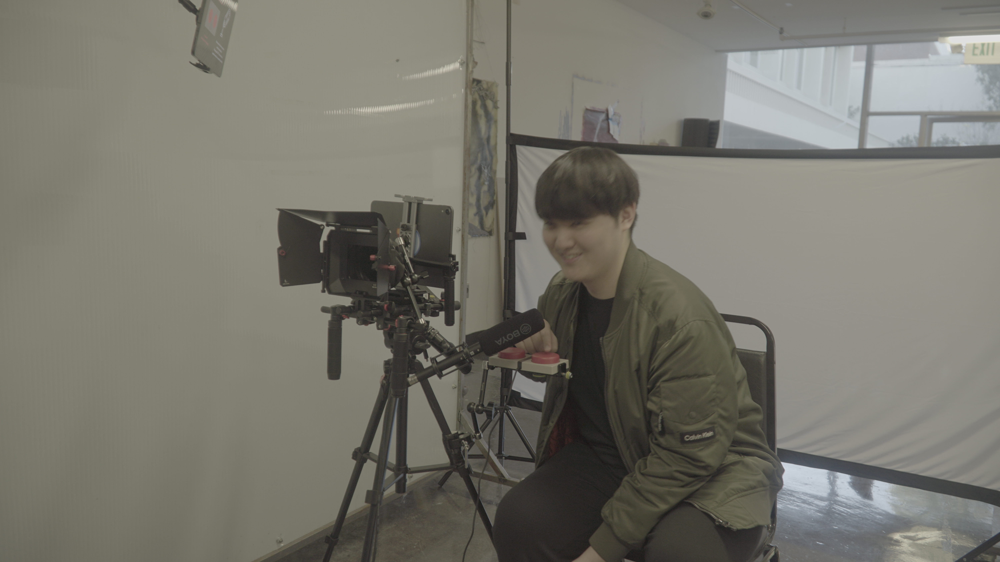
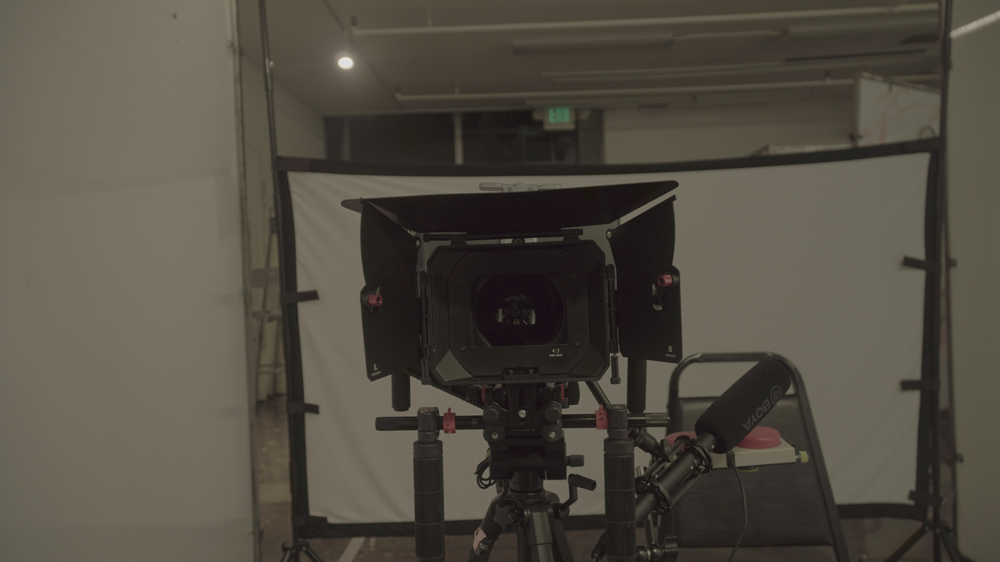
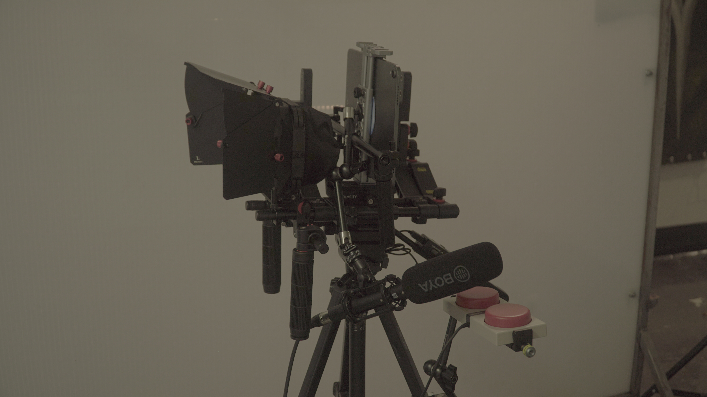
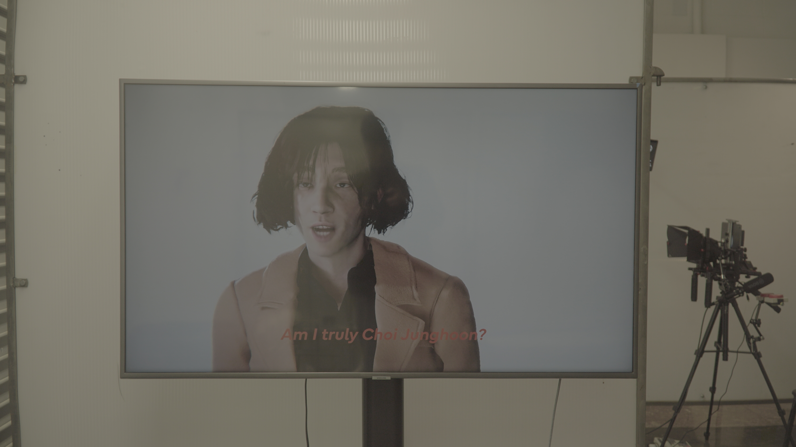
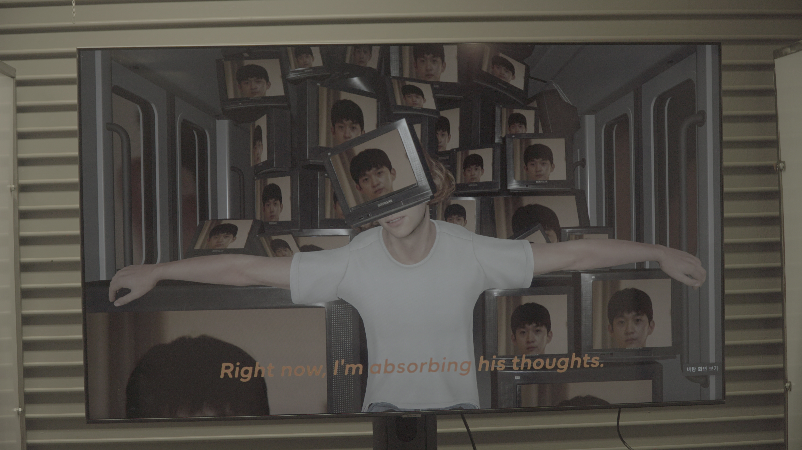
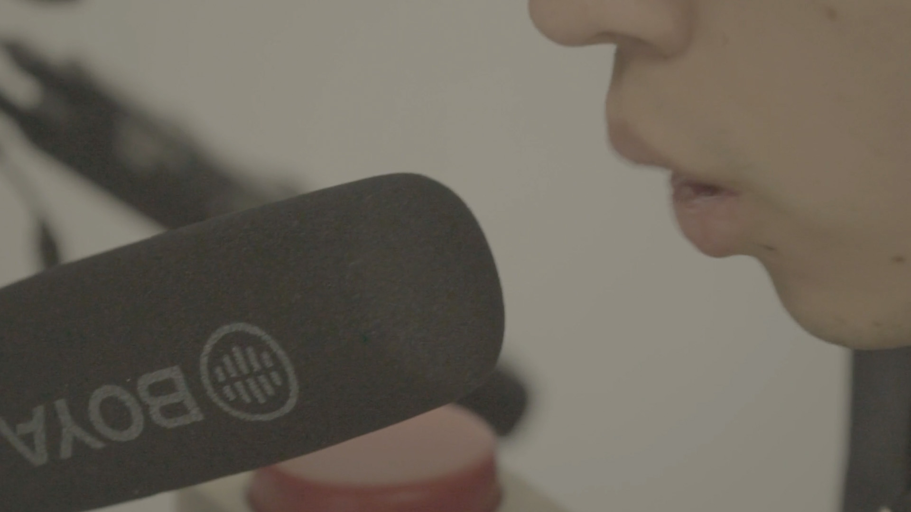

# 🎤 Choi Jung-hoon AI Human Research Project  
**(JANNABI AI Digital Human)**  

[← Back to Digital Human & Virtual Beings](../../README.md)

**Principal Investigator:** Jonghoon Ahn  
**Institution:** California Institute of the Arts  
**Year:** 2024  
**Research Themes:** Digital Human · AI Persona · Emotion Simulation · Human–Machine Interaction  

---

## 🧠 Overview  
**Choi Jung-hoon AI Human** reconstructs the lead vocalist of the Korean band **JANNABI** as an AI-generated digital human.  
This project examines how **identity, emotion, and authorship** can be algorithmically simulated and experienced through generative AI systems.  
The virtual Choi Jung-hoon interacts with audiences in real time—speaking, responding, and performing with a cloned voice and personality derived from his interviews and music performances.  
The work explores the boundaries between **admiration, replication, and authenticity** in the age of human–AI intimacy.

---

## 📚 Research Context  
In an era where fandom, data, and simulation overlap, the project asks:  
> “When emotion becomes code, can affection survive imitation?”  

By reconstructing an artist admired by the creator, this work transforms **fan devotion into algorithmic embodiment**.  
It reimagines parasocial relationships as a site for studying empathy, identity, and authorship within intelligent systems.  
Through the presence of a digital performer who can respond, learn, and mimic, the installation turns **fandom into feedback**,  
revealing the blurred line between real affection and computational empathy.

---

## ⚙️ Technical Methodology  

### 1️⃣ Digital Human Construction  
A high-resolution portrait of Choi Jung-hoon was imported into **Character Creator 4 Headshot Plugin**, generating a photorealistic base mesh.  
The model was refined in **ZBrush** for facial accuracy, then optimized in **Maya** for **UV unwrapping, skin weighting, and rigging**.  
Hair was built using **CC4 Hair Builder**, and a digital replica of his **stage costume** was modeled and textured.  
All materials were exported into **Unity** for animation and shader integration.

  
  

---

### 2️⃣ Voice Cloning (ElevenLabs)  
Using performance and interview samples, Choi Jung-hoon’s vocal dataset was processed through the **ElevenLabs Instant Voice Cloning API**.  
This enabled the AI human to **generate spontaneous speech** in his tone and cadence during live interaction.  
Audio outputs were synchronized with facial blendshapes for **real-time lip-sync animation** within Unity.

---

### 3️⃣ Conversational AI Integration  
The AI persona was powered by the **OpenAI GPT API**, embedded directly in Unity.  
Audience speech input was transcribed and sent to the model, generating dynamic textual responses that were immediately **converted to voice** via ElevenLabs.  
A **C# coroutine** managed asynchronous text-to-speech pipelines, ensuring seamless natural conversation.

---

### 4️⃣ Sensor-Based Interaction (Azure Kinect)  
Through **Azure Kinect’s skeleton and depth tracking**, the AI human could perceive the viewer’s distance, posture, and gestures.  
These inputs triggered emotional expressions—leaning forward, nodding, or raising a hand—mirroring human engagement.  
Additionally, the audience’s form was rendered as a **3D point cloud**, visualizing how the AI perceives human presence.

---

### 5️⃣ Real-Time Rendering & Unity Integration  
All elements—AI dialogue, synthesized speech, motion tracking, and animation—were unified inside Unity’s **real-time pipeline**.  
Custom shaders and lighting were applied to emphasize **digital fragility and emotional realism**,  
turning the character into both mirror and illusion.

---

### Setup  

  
  
  
  
  
  

---

## 🧩 Artistic & Theoretical Focus  
The project investigates **AI-mediated affection**—how emotional projection and algorithmic behavior intertwine.  
It proposes that **identity in the age of AI** is not fixed but collaboratively constructed between human intention and machine response.  
By merging deep learning, motion data, and fan desire, the digital Choi Jung-hoon becomes both a **subject of empathy** and a **simulation of it**.  
This work blurs the boundaries between creator and admirer, performer and algorithm, the real and the virtual self.

---

## 🎥 Video Documentation  

  
   
  <em>Click to view full video on Vimeo</em>

---

## 🔑 Research Keywords  
`#digital-human` `#ai-persona` `#voice-cloning` `#human-ai-interaction` `#cyborg-psychology`

---

## 👤 Credits  
**Principal Investigator / Technical Director:** Jonghoon Ahn  
**Institution:** California Institute of the Arts  
**Year:** 2024  
**Medium:** Interactive Media Installation  
**Tools:** Unity · Character Creator 4 · ZBrush · Maya · ElevenLabs · Azure Kinect · GPT API  

---

## 📬 Contact  
**Website:** [jonghoonahn.com](https://jonghoonahn.com)  
**Email:** [reusahn@gmail.com](mailto:reusahn@gmail.com)  
**Repository:** [Unity-Unreal-Interaction-Research](https://github.com/reusahn/Unity-Unreal-Interaction-Research/tree/main)

---

### 🧠 Suggested Category  
**Cyborg Psychology → Digital Persona → Emotional Simulation**
