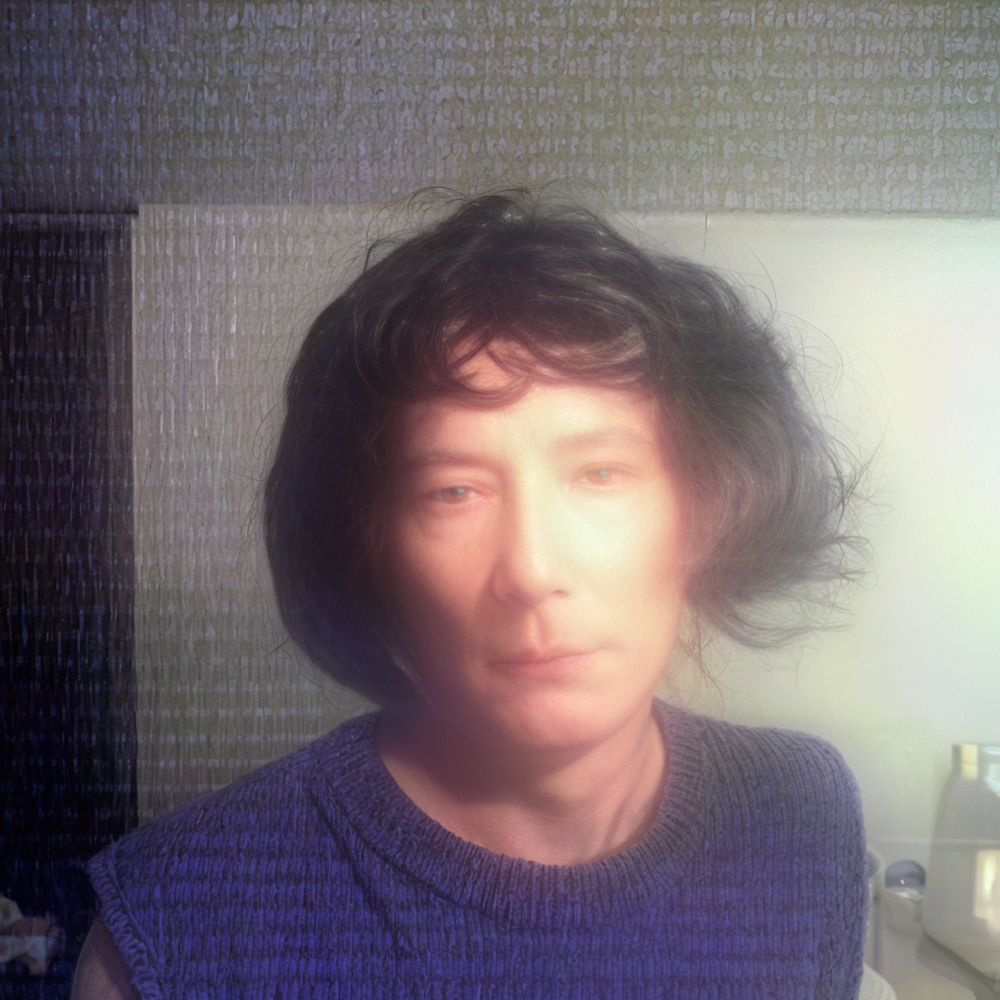
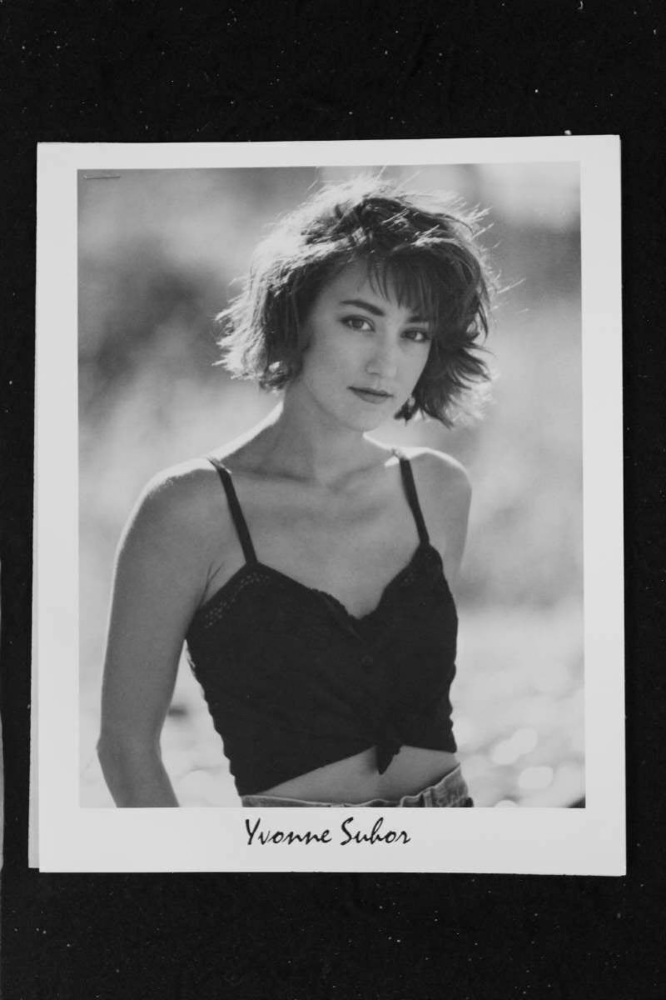
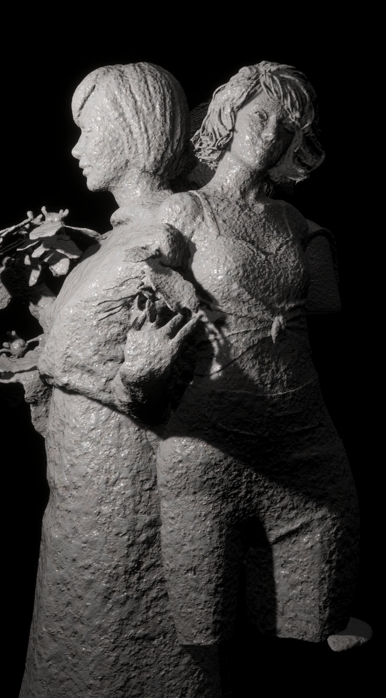
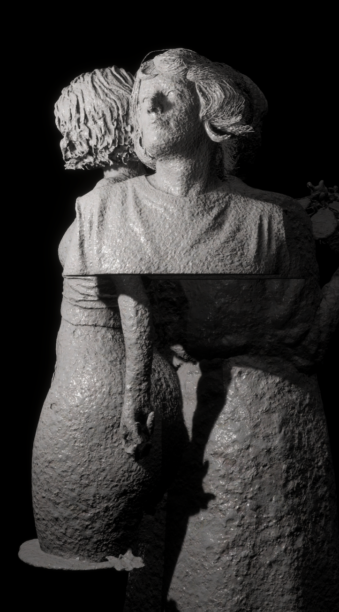
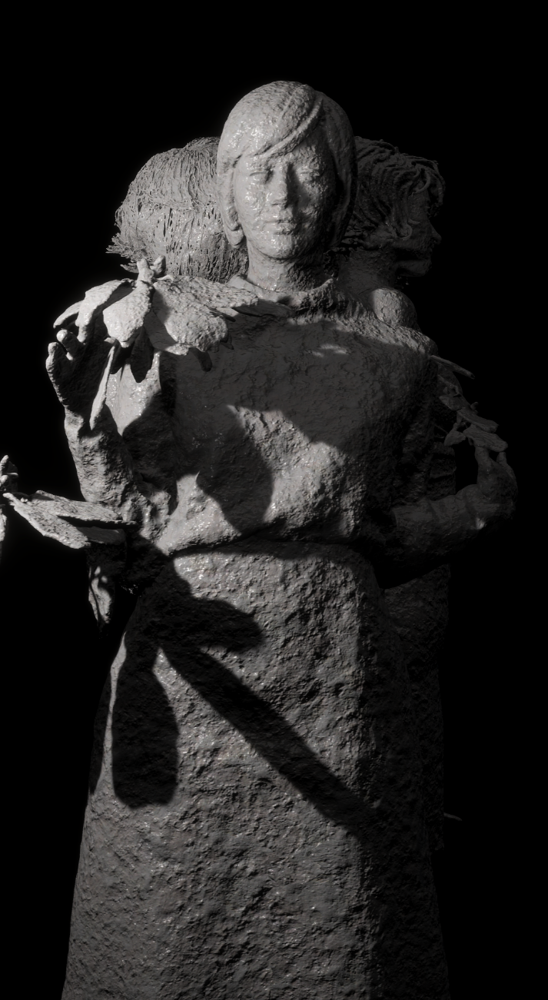

# 🕯️ Scott Collaboration – Digital Memory Sculpture  
**Interactive AI Installation – 2025 · Phase Gallery, Los Angeles**  

[← Back to Digital Human & Virtual Beings](../../README.md)

**Collaborating Artist:** Scott  
**Technical Director:** Jonghoon Ahn  
**Exhibition:** Phase Gallery, Los Angeles  
**Year:** 2025  
**Research Themes:** Digital Memory · AI Reconstruction · Grief and Technology · Interactive Empathy  

---

## 🧩 Overview  
**Scott Collaboration** is an interactive media installation created with artist **Scott**,  
who sought to memorialize his late mother and a close friend through digital preservation and AI-based reanimation.  
The work transforms deteriorated photographs into **3D sculptural portraits**,  
blending stone-like stillness with AI-generated motion to reimagine remembrance as an interactive encounter.  

When a viewer approaches, the static sculptures **awaken**—their surfaces dissolving into  
**particle-based projections** that reveal faintly living presences within.  
Through this transformation, the project questions how **memory, loss, and recognition** manifest  
in an era when even grief becomes computationally encoded.

---

## 📚 Conceptual Framework  
The installation redefines portraiture as a **living memorial**,  
where the boundaries between absence and presence are mediated by machine perception.  
It invites reflection on whether **grief can be interactive**,  
and whether a digital representation can hold emotional truth beyond simulation.  

Through collaboration with Scott, the project becomes both a **technological ritual and an act of digital empathy**,  
where memory is no longer static but responsive—awakening when it is seen.

---

## ⚙️ Technical Methodology  

### 1️⃣ Image Restoration  
Original low-resolution photographs of Scott’s mother and friend were restored using **Topaz Labs AI**,  
enhancing resolution and reducing compression artifacts to recover lost facial details.

    
  
   
  
   
  

### 2️⃣ 3D Reconstruction  
Enhanced images were processed through **Meshy AI**, generating depth maps and initial 3D geometry.  
These were refined in **Blender**, textured with **stone-like shaders**, and sculpted to resemble **memorial busts** that balance physical permanence and digital fragility.

    
    
    

### 3️⃣ AI Motion Generation  
Using **VEO 3**, generative motion loops such as **breathing, blinking, and micro head tilts** were created directly from the 2D portraits.  
The result evokes a subtle simulation of life—a tension between stillness and animation, silence and breath.

### 4️⃣ Unity Integration  
Models and video loops were imported into **Unity HDRP**.  
Using the **Visual Effect Graph**, luminance data from the video was translated into **3D particle systems**,  
causing bright pixels to project outward in depth, forming a **volumetric illusion of light-based presence**.

    
  

### 5️⃣ Interaction System  
Real-time **OpenCV facial recognition** triggered transitions between static and animated states.  
As the viewer’s face enters the sensor’s field, the corresponding sculpture **reanimates**,  
suggesting that memory exists only when acknowledged by another gaze.

### 6️⃣ Lighting & Atmosphere  
Soft volumetric lighting and fog layers created a meditative spatial composition.  
Subtle fluctuations in brightness corresponded to emotional intensity,  
turning the act of viewing into a moment of communion.

    

<em>Using the same generative system – sample visualization from the film research pipeline.</em>

---

## 🧠 Artistic & Research Focus  
**Scott Collaboration** investigates **grief as a system of interaction**.  
It reframes mourning as a process where code, perception, and light become extensions of memory.  

By transforming still photographs into responsive, breathing memorials,  
the work proposes that digital systems can act as **intermediaries for remembrance**—  
not replacing human emotion, but allowing it to persist and evolve through interaction.  

Ultimately, it asks whether a **digital memory can still feel human**,  
and whether to “see” is to **revive** what we have lost.

---

<!--  
## 🎥 Video Documentation  

    
     
  <em>Click to view full video on Vimeo</em>

-->

---

## 🔑 Research Keywords  
`#digital-memory` `#interactive-grief` `#ai-portraiture` `#generative-sculpture` `#posthuman-empathy`

---

## 👤 Credits  
**Collaborating Artist:** Scott  
**Technical Director:** Jonghoon Ahn  
**Exhibition:** Phase Gallery, Los Angeles  
**Medium:** Interactive AI Installation · Digital Sculpture  
**Tools:** Unity HDRP · Blender · Maya · Meshy AI · VEO 3 · Topaz Labs · OpenCV · Python · C#  
**Year:** 2025  

---

## 📬 Contact  
**Website:** [jonghoonahn.com](https://jonghoonahn.com)  
**Email:** [reusahn@gmail.com](mailto:reusahn@gmail.com)  
**Repository:** [Unity-Unreal-Interaction-Research](https://github.com/reusahn/Unity-Unreal-Interaction-Research/tree/main)

---

### 🧠 Suggested Category  
**Cyborg Psychology → Digital Mourning → Interactive Memory Sculpture**
