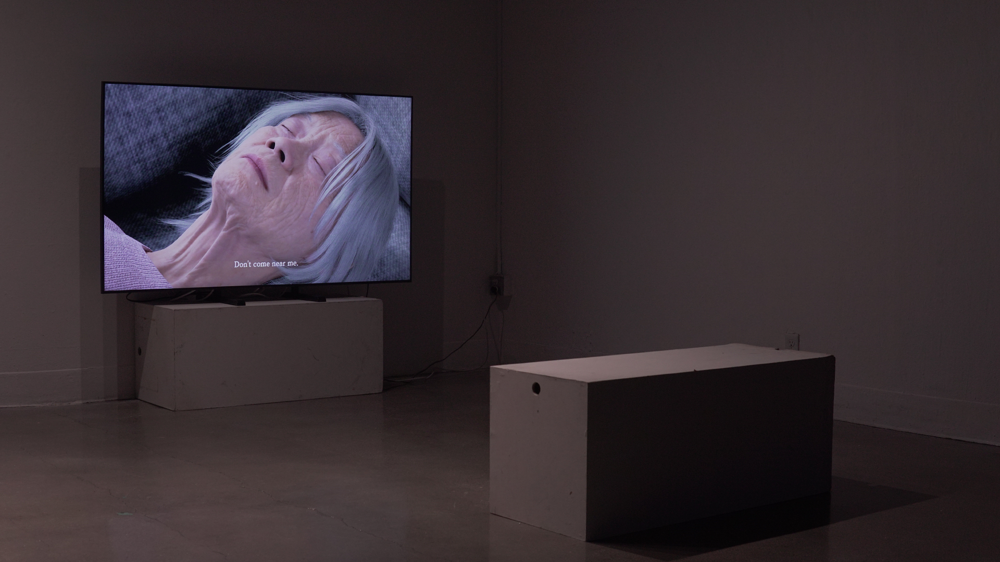
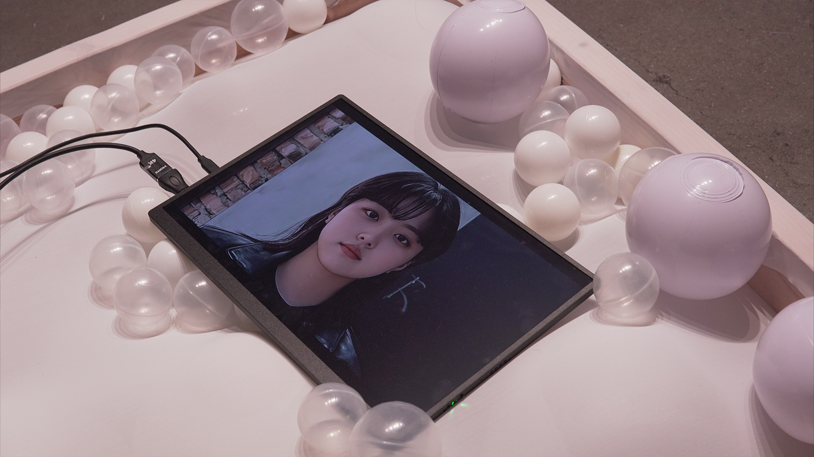
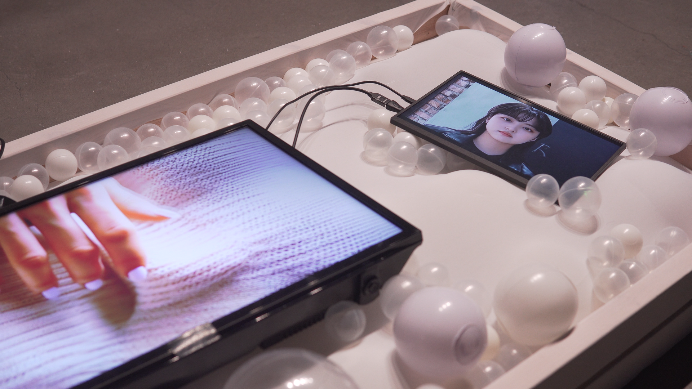
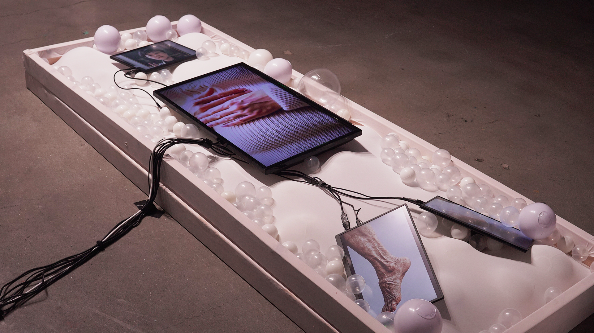
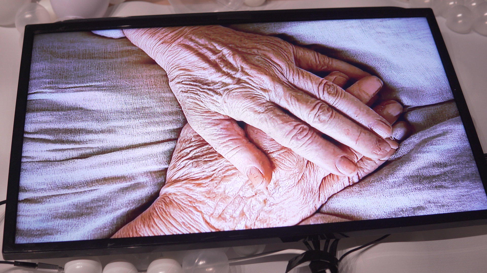
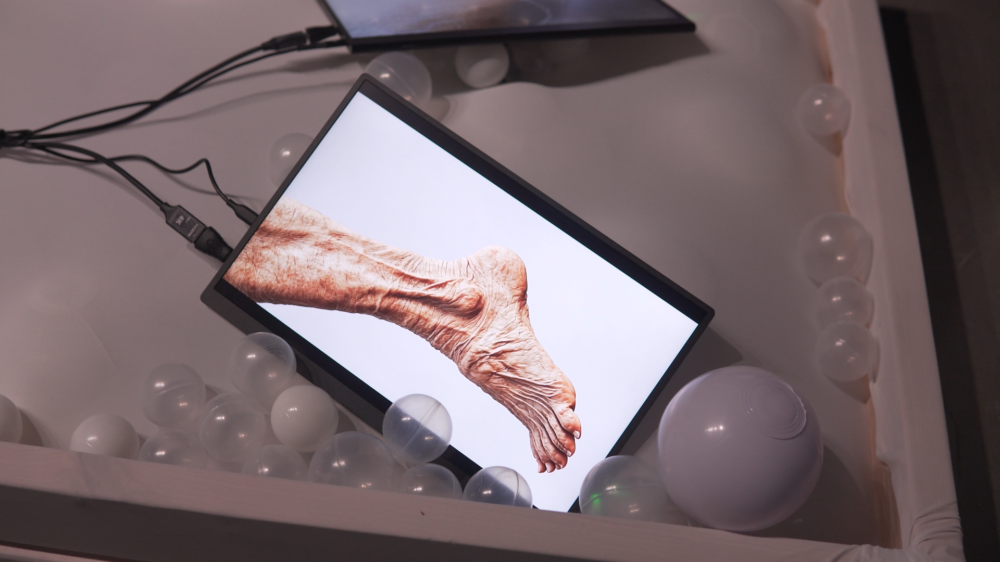

# 🕊️ Seon-A’s Family  
**Digital Resurrection and Emotional Reconciliation through AI**  

[← Back to Digital Human & Virtual Beings](../../README.md)

**Director / Technical Artist:** Jonghoon Ahn  
**Supported by:** Art Korea Lab · Ministry of Culture, Sports and Tourism (MCST) · Korea Arts Management Service (KAMS)  
**Exhibition Venues:** KOTE Gallery (Insadong, Seoul) · Wolseong Yakbang (Gangwon Province)  
**Year:** 2024  
**Research Themes:** Digital Human · AI Voice Cloning · Emotional Memory · Posthuman Media Art  

---

## 🧩 Overview  
**Seon-A’s Family** is a media art project that reconstructs a fractured family relationship through **AI-generated faces, digital humans, and cloned voices**.  
A fictional family—mother, daughter, and sister—was entirely generated from the artist’s own facial and vocal data.  
Through this self-referential reconstruction, the work explores **grief, reconciliation, and emotional inheritance**, transforming digital technology into a process of healing and reflection.  

Set in a **virtual funeral space**, the artist interacts with his AI-generated family, confronting unresolved emotions between life and death.  
The project functions simultaneously as **a personal ritual**, **a psychological experiment**, and **a media installation** exploring empathy between human and artificial life.

---

## 📚 Research Context  
This work emerges from the question:  
> “Can artificial intelligence mediate emotional closure between the living and the digital dead?”  

In the posthuman era, memory and identity can be translated into data.  
By generating family members through AI, the artist turns **machine learning into an emotional mirror**, confronting loss and forgiveness through simulation.  
The project proposes that **grief can be computationally visualized**, not as imitation of life, but as a continuation of presence.

---

## ⚙️ Technical Methodology  

### 1️⃣ Face Generation & Digital Human Reconstruction  
Using **diffusion-based AI models**, the artist’s own facial structure was used to synthesize the likeness of his mother and sister.  
These generated faces were imported into **MetaHuman Creator** to produce lifelike digital humans, later refined in **Maya** and **Blender** for precise rigging and shading.  
Facial detail and motion were fine-tuned to preserve subtle emotion and breathing gestures within **Unreal Engine 5**.

---

### 2️⃣ Voice Cloning & Emotional Variation  
The artist’s own voice was cloned using **ElevenLabs** and then **pitch-shifted and modulated** to form distinct female timbres.  
Each AI voice carried unique emotional parameters (sorrow, distance, warmth), giving individuality to the synthetic family members.  
Through emotional synthesis, voice became an instrument for empathy rather than mimicry.

---

### 3️⃣ Narrative Design & Cinematic Environment  
Based on an autobiographical script written by the artist, the AI dialogues were co-authored using **LLM-based language models** to produce spontaneous emotional responses.  
The **funeral room**—a symbolic environment representing reconciliation—was created in **Unreal Engine** and **Unity**, where light, sound, and motion reflected the state of emotional connection.  
The resulting space exists between ritual and simulation: a digital afterlife where memory speaks back.

---

### 4️⃣ Exhibition Setup  
The final installation was presented at:  
- 🏛 **KOTE Gallery (Insadong, Seoul):** single-channel projection and immersive sound system  
- 🌿 **Wolseong Yakbang (Gangwon Province):** multi-screen display and ambient sound design  

Both spaces served as meditative environments where viewers could witness the digital reunion between the artist and his recreated family.

---

## 🧠 Artistic & Research Focus  
**Seon-A’s Family** investigates how **AI and virtual embodiment** can transform mourning into shared presence.  
By embodying his mother and sister through his own data, the artist questions whether emotional truth can exist within synthetic form.  
The work turns digital resurrection into an act of empathy—revealing that **to grieve digitally is to remember differently**, not to erase, but to reconfigure love and loss through computation.

---

    
  
    
  
    
  
    
  

---

## 🎥 Video Documentation  

    
     
  <em>Click to view full video on Vimeo</em>

---

## 🔑 Research Keywords  
`#digital-human` `#voice-cloning` `#ai-empathy` `#grief-and-technology` `#posthuman-media-art`

---

## 👤 Credits  
**Director / Technical Artist:** Jonghoon Ahn  
**Supported by:** Art Korea Lab · Ministry of Culture, Sports and Tourism (MCST) · Korea Arts Management Service (KAMS)  
**Venues:** KOTE Gallery (Insadong) · Wolseong Yakbang (Gangwon-do)  
**Medium:** Single-Channel Video · Interactive Media Installation  
**Tools:** Unreal Engine 5 · Unity · MetaHuman Creator · ElevenLabs · Stable Diffusion · Python · C#  
**Year:** 2024  

---

## 📬 Contact  
**Website:** [jonghoonahn.com](https://jonghoonahn.com)  
**Email:** [reusahn@gmail.com](mailto:reusahn@gmail.com)  
**Repository:** [Unity-Unreal-Interaction-Research](https://github.com/reusahn/Unity-Unreal-Interaction-Research/tree/main)

---

### 🧠 Suggested Category  
**Cyborg Psychology → AI Memory → Emotional Reconstruction**
