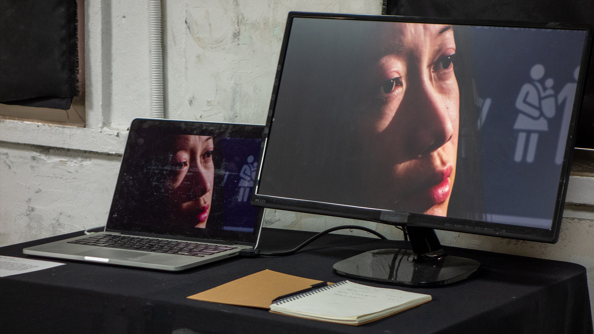
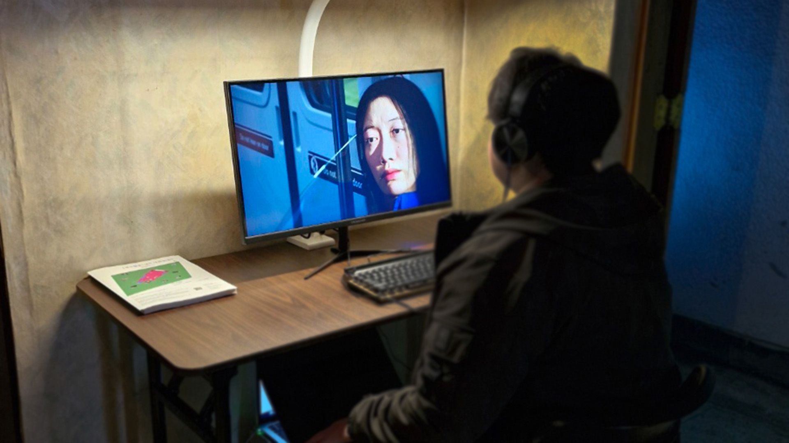
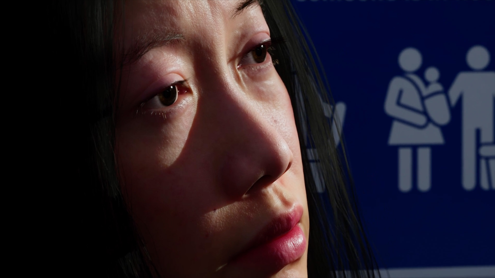

# 🕊️ Seon-A’s Family  
**Digital Resurrection and Emotional Reconciliation through AI**  

[← Back to Digital Human & Virtual Beings](../../README.md)

**Principal Investigator / Director:** Jonghoon Ahn  
**Institution:** California Institute of the Arts  
**Exhibition Venues:** KOTE Gallery (Insadong) · Wolseong Yakbang  
**Year:** 2024  
**Research Themes:** Digital Human · AI Voice Cloning · Grief & Empathy · Posthuman Cinema  

---

## 🧩 Overview  
**Seon-A’s Family** reconstructs a fragmented family relationship through **AI-generated faces, cloned voices, and 3D digital humans**.  
A virtual family—mother, daughter, and sister—was created entirely from the artist’s own facial and vocal data, forming an introspective dialogue between the real self and its synthetic extensions.  

Set within a **virtual funeral space**, the project transforms grief into a performative encounter between human and machine.  
The artist converses with his AI-generated relatives, facing unspoken emotions between life and death.  
The work functions simultaneously as **personal ritual, cinematic fiction, and human–AI research**, exploring how technology can mediate emotional healing.

---

## 📚 Research Context  
In posthuman studies, the act of **recreating the self through data** is both an artistic gesture and a psychological experiment.  
This project explores whether **empathy can emerge from simulation**—whether algorithmic reconstructions of those we’ve lost can enable emotional closure.  
By transforming his own face and voice into multiple familial roles, the artist turns machine learning into a mirror for grief, memory, and forgiveness.

---

## ⚙️ Technical Methodology  

### 1️⃣ Face Generation & Digital Human Creation  
Using diffusion-based AI models, the artist’s own facial features were re-synthesized to generate the likenesses of his mother and sister.  
These were imported into **MetaHuman Creator** for realistic 3D reconstruction, rigging, and shading.  
Fine adjustments in **Maya** and **Blender** refined expression range and surface realism before animation inside **Unreal Engine 5**.

    
  

---

### 2️⃣ Voice Cloning and Emotion Mapping  
Through **ElevenLabs Voice Cloning**, the artist’s voice was duplicated and pitch-shifted into female registers, producing distinct yet genetically linked tones for each character.  
Emotion parameters (joy, sorrow, hesitation) were embedded within each voice profile, allowing the AI family to respond with subtle affective variation.

---

### 3️⃣ Narrative Composition and Cinematic Integration  
Dialogue scripts—based on personal memoirs—were processed through LLM-based language models to generate alternate responses and reflections.  
The resulting exchange was animated in **Unreal Sequencer** and **Unity Timeline**, where lighting, camera depth, and environmental sound conveyed the ambience of a digital afterlife.  
The funeral setting became a space of both mourning and reunion — a shared interface between memory and machine.

---

### 4️⃣ Exhibition Environment  
The installation was presented across two venues:  
- **KOTE Gallery (Insadong):** single-channel projection and immersive sound system  
- **Wolseong Yakbang:** multi-screen setup for dialogue loop and AI response interface  

Each space acted as a ritual chamber, inviting viewers to witness the artist’s digital conversation with his reconstructed family.

---

## 🧠 Artistic & Theoretical Focus  
**Seon-A’s Family** redefines remembrance as a computational act.  
It asks whether synthetic representation can carry emotional truth, and whether AI can mediate the process of forgiveness.  
By re-embodying his family within a digital ecosystem, the artist transforms technology into an instrument for mourning and reconciliation—  
an experiment in **AI as empathic medium** and in **memory as code**.

---

## 🎥 Video Documentation  

    
     
  <em>Click to view full video on Vimeo</em>

---

## 🔑 Research Keywords  
`#digital-human` `#voice-cloning` `#ai-empathy` `#grief-and-technology` `#cyborg-psychology`

---

## 👤 Credits  
**Director / Technical Artist:** Jonghoon Ahn  
**Institution:** California Institute of the Arts  
**Year:** 2024  
**Medium:** Single-Channel Video · Interactive Media Installation  
**Tools:** Unreal Engine 5 · Unity · MetaHuman Creator · ElevenLabs · Stable Diffusion · Python · C#  

---

## 📬 Contact  
**Website:** [jonghoonahn.com](https://jonghoonahn.com)  
**Email:** [reusahn@gmail.com](mailto:reusahn@gmail.com)  
**Repository:** [Unity-Unreal-Interaction-Research](https://github.com/reusahn/Unity-Unreal-Interaction-Research/tree/main)

---

### 🧠 Suggested Category  
**Cyborg Psychology → AI Memory → Emotional Reconstruction**
