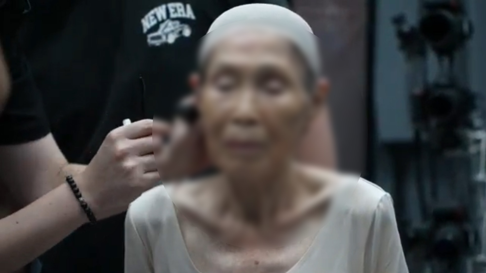
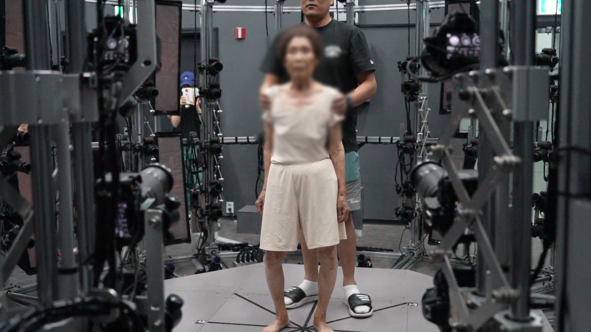

# 👵 Shin Inho – Digital Human Reconstruction  
**Volumetric Memory & Digital Heritage Project – 2025**  

[← Back to Digital Human & Virtual Beings](../../README.md)

**Collaborating Artist:** Yaloo  
**Technical Director:** Jonghoon Ahn  
**Institution:** California Institute of the Arts  
**Year:** 2025  
**Research Themes:** Digital Heritage · AI Memory · Volumetric Capture · Emotional Reconstruction  

---

## 🧩 Overview  
**Shin Inho** is a digital human reconstruction project that revives **Yaloo’s late grandmother** through **volumetric 3D scanning and AI-driven animation**.  
Using full-body volumetric imaging, her physical presence was preserved and restructured through **digital rigging, facial synthesis, and real-time rendering**.  

The project seeks to **preserve emotional memory through computation**, blending affection, grief, and technology into a single living archive.  
Subtle gestures—breathing, blinking, head tilts—were generated algorithmically, granting digital form to a person whose body no longer exists in the physical world.

---

## 📚 Conceptual Framework  
This work questions how technology mediates **memory, death, and continuity**.  
By digitally reviving a loved one, *Shin Inho* turns remembrance into a form of creation—  
where data, rather than merely storing life, **reactivates presence** through motion, texture, and emotion.  

Rather than reproducing likeness, the project treats digital resurrection as **emotional continuity**—  
a conversation between the living and the algorithmic echoes of the departed.

---

## ⚙️ Technical Methodology  

### 1️⃣ Volumetric Capture  
A full-body scan was conducted in a professional **volumetric studio**, producing a **4K texture-mapped mesh** of the grandmother’s figure.  
Dozens of synchronized cameras captured both geometry and albedo information to maintain physical realism.

    
   

### 2️⃣ Auto-Rigging & Facial Setup  
The volumetric model was auto-rigged using a custom skeleton generator and refined manually in **Maya**.  
Facial expressions were built with the **Faceit plugin**, generating **64 ARKit-compatible blendshapes** to enable nuanced animation and emotion.

### 3️⃣ Material & Shader Refinement  
Textures were cleaned and color-corrected in **Photoshop** and **Substance Painter**.  
Shaders in **Unity** simulated **subsurface scattering and organic translucency**, creating the visual impression of living skin.

### 4️⃣ Hair & Accessory Simulation  
Hair strands were rigged and simulated with **Unity Hair Solution**, giving subtle motion responsive to the environment.  
Personal items—such as **dental ornaments and jewelry**—were manually modeled and attached to the rig hierarchy to preserve authenticity and physical integrity.

### 5️⃣ Real-Time Rendering  
The reconstructed model was rendered interactively in both **Unity** and **Unreal Engine 5**, allowing live playback of emotional gestures derived from an **AI-driven motion dataset**.

    
  <!--  -->

---

## 🧠 Artistic & Research Focus  
**Shin Inho** explores the boundary between **technological preservation and emotional authenticity**,  
asking whether **data can remember affection** or **simulate presence without imitation**.  

Through digital resurrection, the work reframes grief as an act of collaboration between human memory and machine learning.  
It suggests that remembrance in the digital age is no longer static—  
it is **interactive, evolving, and affective**, a shared process between love and computation.

---

## 🎥 Video Documentation  

    
     
  <em>Click to view full video on Instagram</em>

---

## 🔑 Research Keywords  
`#digital-human` `#volumetric-memory` `#ai-empathy` `#digital-heritage` `#grief-and-technology`

---

## 👤 Credits  
**Collaborating Artist:** Yaloo  
**Technical Director:** Jonghoon Ahn  
**Institution:** California Institute of the Arts  
**Medium:** Digital Human Reconstruction · Volumetric Capture · Real-Time Rendering  
**Tools:** Unity · Unreal Engine 5 · Maya · Blender · Faceit Plugin · Substance Painter · Photoshop · Python · C#  
**Year:** 2025  

---

## 📬 Contact  
**Website:** [jonghoonahn.com](https://jonghoonahn.com)  
**Email:** [reusahn@gmail.com](mailto:reusahn@gmail.com)  
**Repository:** [Unity-Unreal-Interaction-Research](https://github.com/reusahn/Unity-Unreal-Interaction-Research/tree/main)

---

### 🧠 Suggested Category  
**Cyborg Psychology → Digital Heritage → Emotional Reconstruction**
