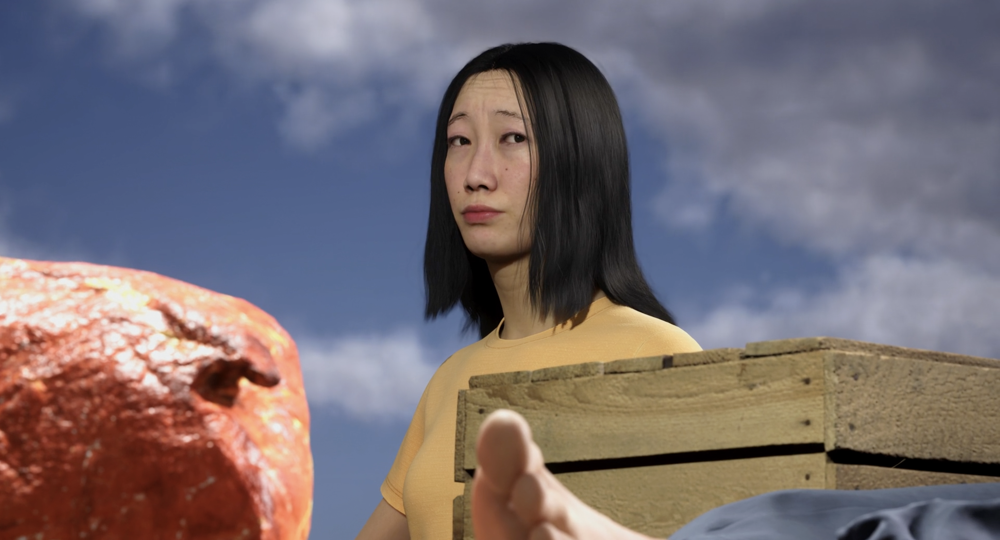
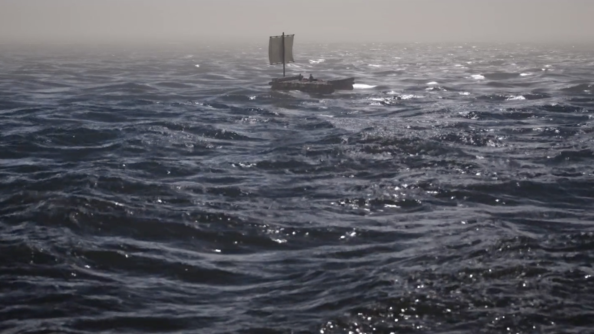

# 🌊 Whispers – Mythomania  
**3D Psychological Short Film Co-directed with Artificial Intelligence**  

[← Back to Digital Human & Virtual Beings](../../README.md)

**Director / Technical Artist:** Jonghoon Ahn  
**Institution:** California Institute of the Arts  
**Year:** 2024  
**Research Themes:** AI Storytelling · Digital Cinema · Emotional Simulation · Human–Machine Authorship  

---

## 🧩 Overview  
**Whispers – Mythomania** is a 3D psychological short film that explores **guilt, morality, and survival** through a process of **AI-assisted storytelling**.  
Three strangers awaken on a drifting raft, sharing fragments of memory and mysterious food to survive.  
As silence grows heavier, their guilt surfaces—and those who justify their sins slowly vanish into the sea.  

The film was **co-written and visually developed through continuous dialogue with AI systems**, merging human narrative intuition with algorithmic logic.  
Rather than treating AI as a tool, this project positions it as a **creative partner** that influences structure, tone, and atmosphere.  

---

## 📚 Research Context  
This work originates from the artist’s question:  
> “If intelligence can generate empathy, can a story still belong to one author?”  

As large language models begin to shape culture and narrative, *Whispers – Mythomania* investigates how creative control dissolves between human intention and computational pattern.  
The project serves as an experiment in **shared authorship**, where AI not only assists storytelling but actively challenges emotional perception and moral interpretation.  

---

## ⚙️ Technical Methodology  

### 1️⃣ AI Co-Writing Process  
The screenplay was written through **iterative dialogue with ChatGPT**, allowing AI to suggest symbolic variations and psychological motifs.  
Each draft integrated algorithmic narrative proposals—altering scene rhythm, emotional tone, and metaphorical language—until a final hybrid text emerged.  

### 2️⃣ Digital Performance & Environment  
Characters were built using **MetaHuman Creator**, refined in **Maya** and **Blender** for subtle facial expression and motion.  
The oceanic environment, designed in **Unreal Engine 5**, used **Water System** and **Chaos Physics** to simulate natural movement and instability—mirroring the moral turbulence of the narrative.  

    
  

---

### 3️⃣ AI Voice & Sound Design  
All voice performances were generated through **ElevenLabs**, using emotional modulation to express hesitation, fear, and confession.  
AI-generated music from **Mubert** was layered with ambient soundscapes, forming a sonic dialogue between human emotion and machine interpretation.  

### 4️⃣ Editing & Visual Language  
Postproduction employed **DaVinci Resolve**, emphasizing cinematic realism through path-traced lighting and muted tonal palettes.  
The aesthetic blurs the line between simulation and memory, reinforcing the psychological theme of truth distorted by silence.

---

## 🧠 Artistic & Theoretical Focus  
*Whispers – Mythomania* examines authorship in the age of intelligent machines.  
By directing a film *with* AI, rather than *about* AI, the project redefines narrative creation as a **reciprocal process between emotion and computation**.  
The work asks whether empathy can arise not from human actors alone, but from collaboration between human sensitivity and algorithmic imagination.  

It reflects on the paradox of creation in the AGI era—  
where storytelling becomes both an act of communication and a mirror for our shared uncertainty about what is real, sincere, or moral.

---

## 🎥 Video Documentation  

    
     
  <em>Click to view full video on Vimeo</em>

---

## 🔑 Research Keywords  
`#ai-storytelling` `#digital-cinema` `#co-authorship` `#human-ai-collaboration` `#psychological-film`

---

## 👤 Credits  
**Director / Technical Artist:** Jonghoon Ahn  
**AI Collaborator:** ChatGPT (Story Development) · ElevenLabs (Voice Performance) · Mubert (Soundtrack Generation)  
**Software:** Unreal Engine 5 · MetaHuman Creator · Maya · Blender · DaVinci Resolve  
**Hardware:** PC (NVIDIA RTX 4070 Super, Intel i9, 32GB RAM)  
**Medium:** 3D Animated Short Film  

---

## 📬 Contact  
**Website:** [jonghoonahn.com](https://jonghoonahn.com)  
**Email:** [reusahn@gmail.com](mailto:reusahn@gmail.com)  
**Repository:** [Unity-Unreal-Interaction-Research](https://github.com/reusahn/Unity-Unreal-Interaction-Research/tree/main)

---

### 🧠 Suggested Category  
**Cyborg Psychology → AI Authorship → Emotional Storytelling**
