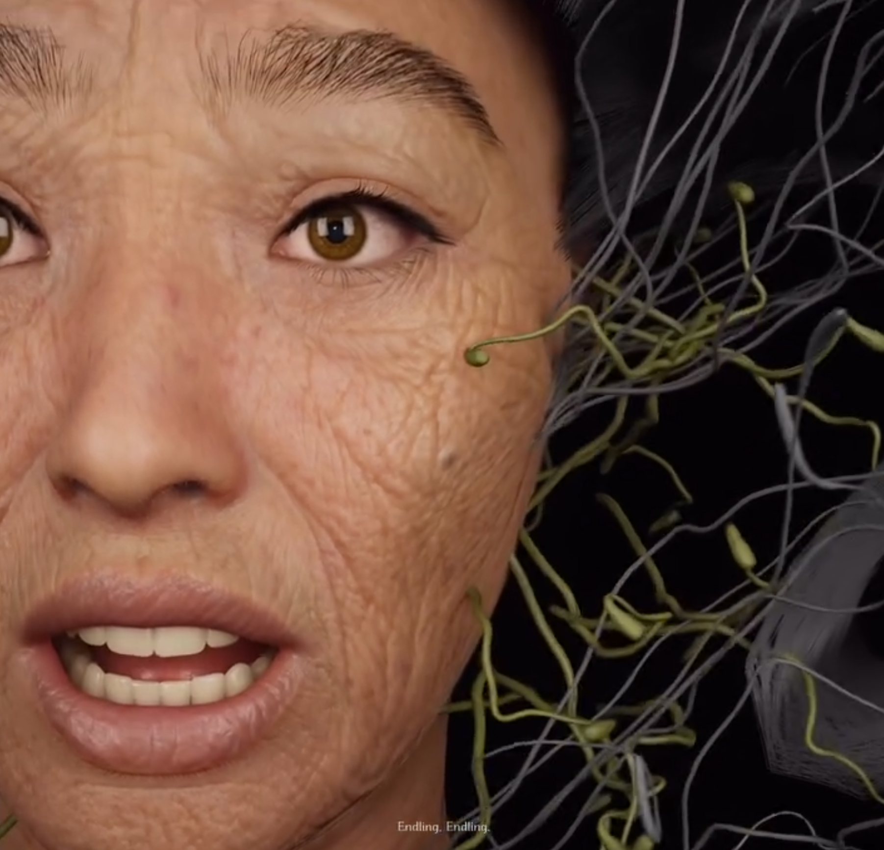
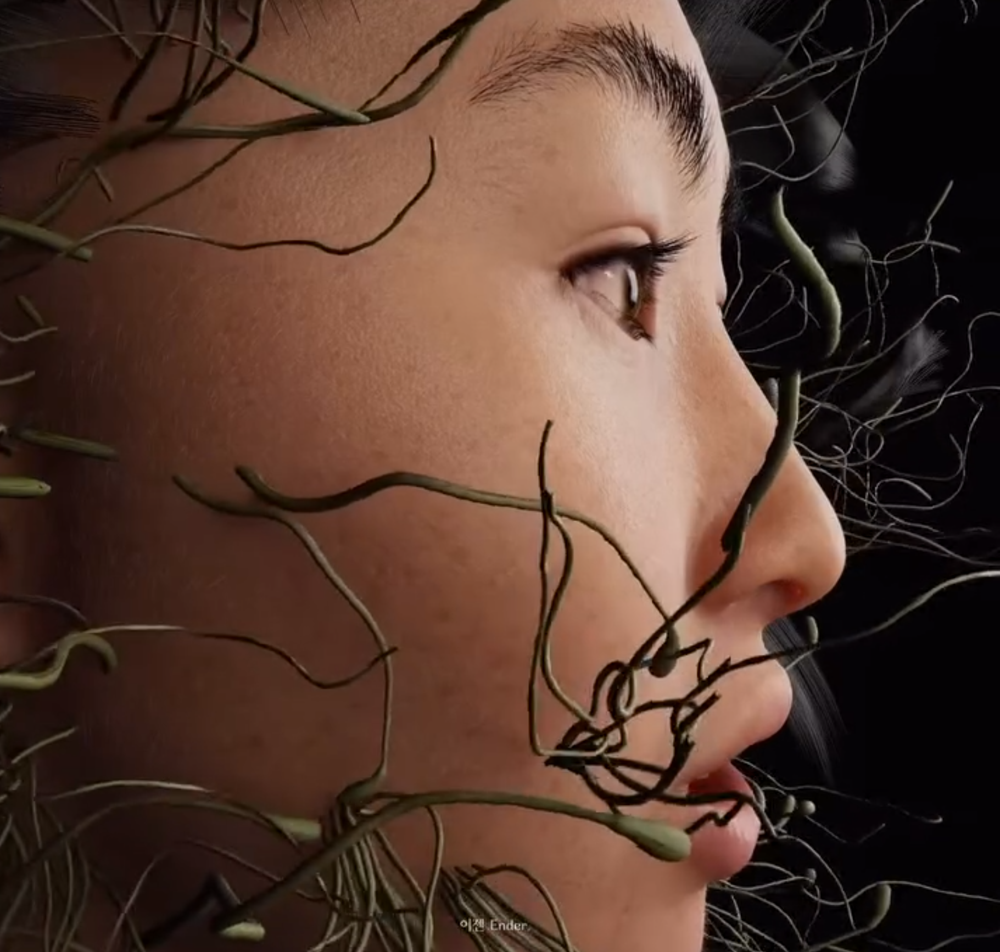

# 🌿 Yaloo_Collaboration  
**Posthuman Media Art Collaboration – 2024 · Gyeonggi Museum of Modern Art**  

[← Back to Digital Human & Virtual Beings](../../README.md)

**Collaborating Artist:** Yaloo  
**Technical Director:** Jonghoon Ahn  
**Institution:** Gyeonggi Museum of Modern Art  
**Year:** 2024  
**Research Themes:** Posthuman Identity · Digital Ecology · Hybrid Embodiment · AI Collaboration  

---

## 🧩 Overview  
**Yaloo_Collaboration** is a posthuman media art project developed in collaboration with media artist **Yaloo**, exploring identity, transformation, and digital ecology through computational embodiment.  
The work reimagines Yaloo as a **hybrid being merging human and seaweed**, symbolizing ecological coexistence and technological rebirth.  

Exhibited at the **Gyeonggi Museum of Modern Art**, the piece visualizes continuous metamorphosis between **a child, an adult, and an elder**, each stage representing an interconnected rhythm of life and nature.  
Through **real-time morphing and bioluminescent materials**, the work reflects how digital organisms can embody emotional and biological cycles within virtual environments.

---

## 📚 Conceptual Framework  
This collaboration originates from the idea that **the human body is no longer singular, but ecological**.  
By fusing organic and synthetic materials, the artwork proposes a **fluid identity**—where the boundary between self and environment dissolves into a shared digital ecosystem.  
The project situates itself within **posthumanist discourse**, examining how empathy, care, and transformation may manifest beyond the limits of human form.

---

## ⚙️ Technical Methodology  

### 1️⃣ Facial Capture & MetaHuman Creation  
A facial video of **Yaloo** was processed into a 3D mesh using **MetaHuman Creator**, refined for anatomical accuracy and expressive range.  
The model was textured and shaded to retain Yaloo’s natural features while enabling transformation across different digital life stages.

### 2️⃣ Hybrid Body Construction  
A **child’s body** was generated in **Character Creator 4 (CC4)**.  
The **MetaHuman head** and **CC4 body**—built on separate skeleton hierarchies—were merged inside **Unreal Engine 5** through custom retargeting, forming a single seamless hybrid entity.

### 3️⃣ Hair & Material Simulation  
Hair strands were modeled in **Blender**, stylized to resemble **seaweed filaments**, and imported as **Alembic (.ABC)** caches to preserve dynamic deformation.  
Procedural shaders mimicked underwater translucency and organic shimmer, creating a living texture between marine biology and digital artifice.

### 4️⃣ Motion Capture Integration  
- **Facial Motion:** Recorded via **Apple ARKit (iPhone)** and re-applied in **Unreal Sequencer** as CSV keyframes.  
- **Body Motion:** Captured using **Move.ai**, translating 2D performance footage into full skeletal animation.  
The combined system produced a synchronized, breathing hybrid presence—part human, part aquatic organism.

### 5️⃣ Environmental & Lighting Design  
Using **Lumen** and volumetric fog, lighting simulated an aquatic depth, while shaders projected **bioluminescent reflections** echoing transformation and interspecies empathy.

    
    
  

---

## 🧠 Artistic & Research Focus  
This collaboration explores **digital hybridity and ecological embodiment** as both aesthetic and ethical practice.  
By merging **MetaHuman**, **CC4**, and **Move.ai**, it redefines the digital human as an **evolving organism of empathy**, rather than a static replica.  

The work argues that technological creation can be an act of **coexistence**—a living collaboration between human identity and nonhuman material.  
Through this lens, *Yaloo_Collaboration* expands the idea of portraiture into a **biotechnological ecosystem**, where transformation becomes a language of care.

---

## 🎥 Video Documentation  

    
     
  <em>Click to view full video on Instagram</em>

---

## 🔑 Research Keywords  
`#posthuman-identity` `#digital-ecology` `#hybrid-body` `#media-art` `#collaborative-creation`

---

## 👤 Credits  
**Collaborating Artist:** Yaloo  
**Technical Director:** Jonghoon Ahn  
**Institution:** Gyeonggi Museum of Modern Art  
**Medium:** Digital Human · Interactive Media Installation  
**Tools:** Unreal Engine 5 · MetaHuman Creator · Character Creator 4 · Blender · Move.ai · Marvelous Designer · Python · C#  
**Year:** 2024  

---

## 📬 Contact  
**Website:** [jonghoonahn.com](https://jonghoonahn.com)  
**Email:** [reusahn@gmail.com](mailto:reusahn@gmail.com)  
**Repository:** [Unity-Unreal-Interaction-Research](https://github.com/reusahn/Unity-Unreal-Interaction-Research/tree/main)

---

### 🧠 Suggested Category  
**Cyborg Psychology → Posthuman Ecology → Collaborative Embodiment**
