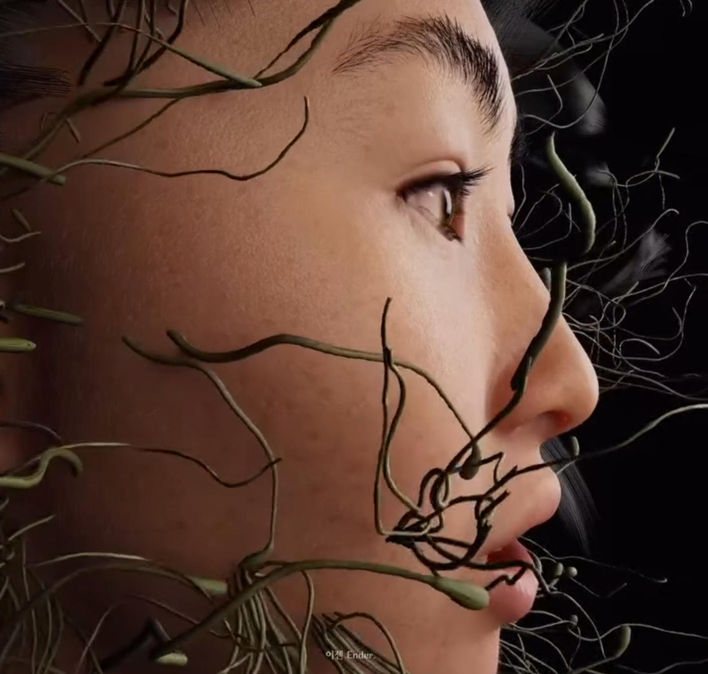

# 🌿 Yaloo_Collaboration  
*(Posthuman Media Art Collaboration – 2024 · Gyeonggi Museum of Modern Art)*  

[← Back to main repository](https://github.com/reusahn/Unity-Unreal-Interaction-Research/tree/main)

---

## 🧩 Overview  
**Yaloo_Collaboration** is a posthuman media art project created in collaboration with media artist **Yaloo**, exploring identity, transformation, and digital ecology.  
The work reimagines Yaloo as a **hybrid being merging human and seaweed**, symbolizing ecological coexistence and digital rebirth.  

Exhibited at the **Gyeonggi Museum of Modern Art**, the piece visualizes continuous metamorphosis between **a child, an adult, and an elder**, each representing stages of life and nature’s regenerative cycle.  
Through real-time transformation, it reveals how digital organisms can embody emotional and biological rhythms within a computational environment.

---

## ⚙️ Technical Description  
- **Engine:** Unreal Engine 5  
- **Software:** MetaHuman Creator · Character Creator 4 (CC4) · Blender · Maya · Marvelous Designer  
- **Language:** Python · C#  
- **Hardware:** PC (NVIDIA RTX 4070 Super)  
- **Pipeline:**  
  1. **Facial Capture & MetaHuman Creation:**  
     A facial video of artist **Yaloo** was converted into a 3D mesh, reconstructed in **MetaHuman Creator**, and refined to preserve her facial likeness.  
  2. **Hybrid Body Design:**  
     A **child’s body** was created in **Character Creator 4 (CC4)**.  
     The MetaHuman head and CC4 body—built on distinct rigging systems—were merged inside **Unreal Engine**, forming a single hybrid character through custom retargeting.  
  3. **Hair & Material Development:**  
     Hair was sculpted in **Blender**, stylized to resemble **seaweed strands**, and imported into Unreal as an **Alembic (ABC)** file to maintain motion deformation.  
     Dynamic hair animation was parented to the head rig, allowing subtle, organic underwater movement.  
  4. **Facial & Body Motion Capture:**  
     - **Facial mocap:** Recorded with **Apple ARKit (iPhone)**, exported as CSV keyframe data, then re-applied in Unreal’s Sequencer.  
     - **Body motion:** Generated using **Move.ai**, converting 2D performance video into skeletal animation.  
  5. **Shader & Lighting Design:**  
     Procedural materials and translucent shaders recreated **bioluminescent marine textures**,  
     while light caustics and fog layers simulated an aquatic atmosphere reflecting posthuman transformation.  

---

## 🧠 Artistic & Research Focus  
The project examines **posthuman identity**, **digital–organic hybridity**, and **ecological embodiment** through technical and aesthetic synthesis.  
By combining **MetaHuman**, **CC4**, and **Move.ai**, it redefines digital humans as **organisms of collaboration**—not static representations but evolving systems of empathy and transformation.  

This work proposes that technological creation can serve as an **act of coexistence**,  
where human identity is continuously reinterpreted through nonhuman materials and computational environments.

---

## 🖼️ Media

    
  
    

---

## 🎥 Video Documentation

  
   
  <em>Click to view full video on Vimeo</em>

---

## 👤 Credits  
**Collaborating Artist:** Yaloo  
**Technical Director:** Jonghoon Ahn  
**Year:** 2024  
**Exhibition:** Gyeonggi Museum of Modern Art  
**Medium:** Digital Human · Interactive Media Installation  

---

## 🔗 Related  
- [Back to Digital Human & Virtual Beings](../README.md)  
- [View All Projects](https://github.com/reusahn/Unity-Unreal-Interaction-Research/tree/main)
