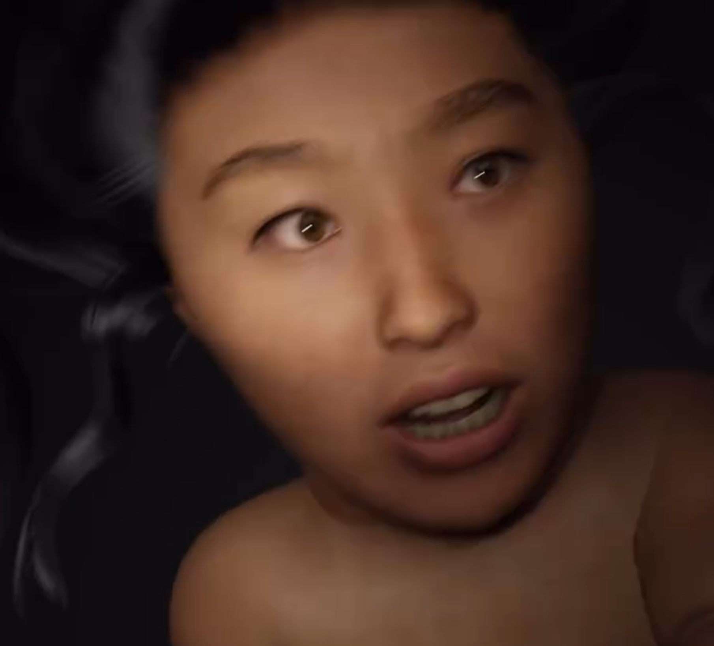

# 🌿 Yaloo_Collaboration  
*(Posthuman Media Art Collaboration – 2024)*  

[← Back to main repository](https://github.com/reusahn/Unity-Unreal-Interaction-Research/tree/main)

---

## 🧩 Overview  
**Yaloo_Collaboration** is a posthuman media art project created in collaboration with artist **Yaloo**, exploring identity, transformation, and digital ecology.  
The work reimagines Yaloo as a **hybrid being merging human and seaweed**, a symbolic organism that embodies posthuman evolution and ecological interconnectedness.  

The creature possesses Yaloo’s facial features while fluidly transforming between the appearances of a **child, adult, and elder**, reflecting cyclical time and the continuous regeneration of life.  
Through this mutable existence, the project visualizes the merging of organic and digital bodies, suggesting a future where humanity and nature coexist through technological synthesis.

---

## ⚙️ Technical Description  
- **Engines:** Unity · Unreal Engine 5  
- **Software:** Maya · Blender · Marvelous Designer  
- **Language:** C# · Python  
- **Hardware:** PC (NVIDIA RTX 4090), VR Headset  
- **Pipeline:**  
  1. 3D character sculpting and facial reconstruction based on Yaloo’s likeness  
  2. Procedural material and shader development for seaweed–skin textures  
  3. Morphing system integrating age-based facial states (child → adult → elder)  
  4. Real-time rendering environment built in Unity and Unreal  
  5. Dynamic cloth and fluid motion simulation using Marvelous Designer and Niagara  
  6. Lighting and posthuman atmosphere design emphasizing aquatic transformation  

---

## 🧠 Artistic & Research Focus  
This collaboration investigates **posthuman identity**, **digital organismal evolution**, and **ecological embodiment**.  
By merging human facial recognition with organic marine textures, the project explores how **technology can express symbiosis rather than domination**.  
It positions the **posthuman body** as a site of empathy and transformation—an interface between nature, machine, and memory.

---

## 🖼️ Media

    
  

---

## 🎥 Video Documentation

  

---

## 👤 Credits  
**Collaborating Artist:** Yaloo  
**Technical Director:** Jonghoon Ahn  
**Year:** 2024  
**Institution:** California Institute of the Arts  
**Medium:** Interactive Media · Digital Human  

---

## 🔗 Related  
- [Back to Digital Human & Virtual Beings](../README.md)  
- [View All Projects](https://github.com/reusahn/Unity-Unreal-Interaction-Research/tree/main)
