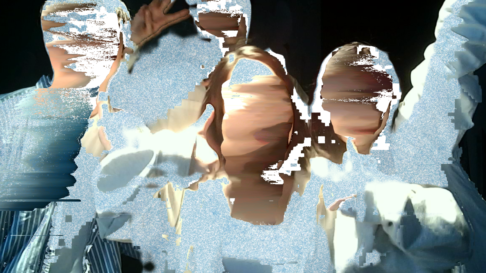
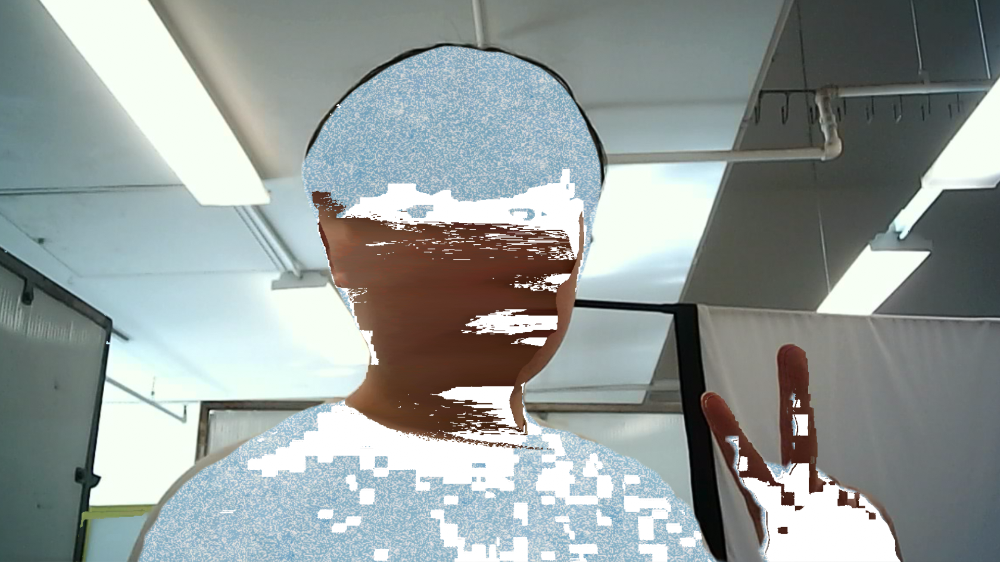
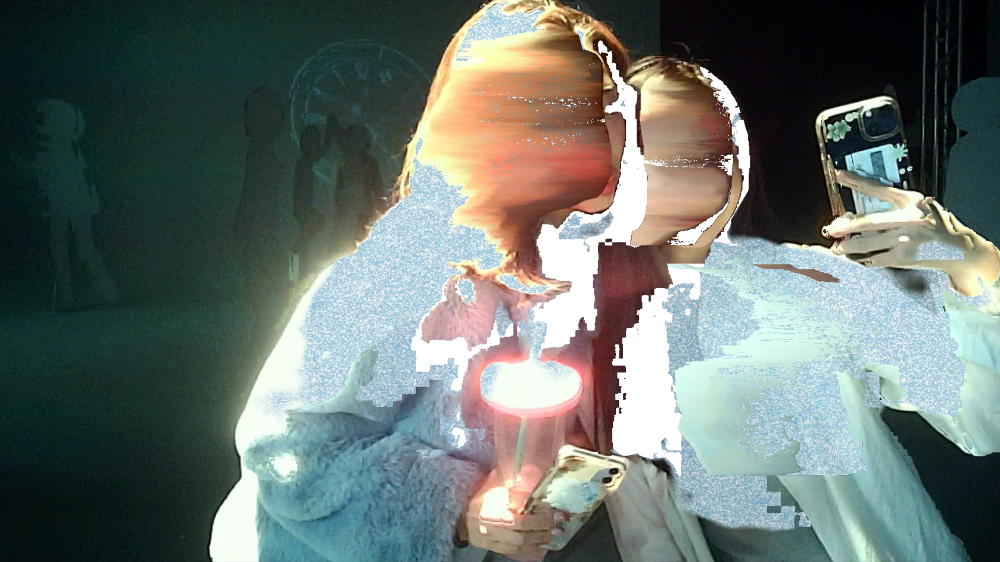
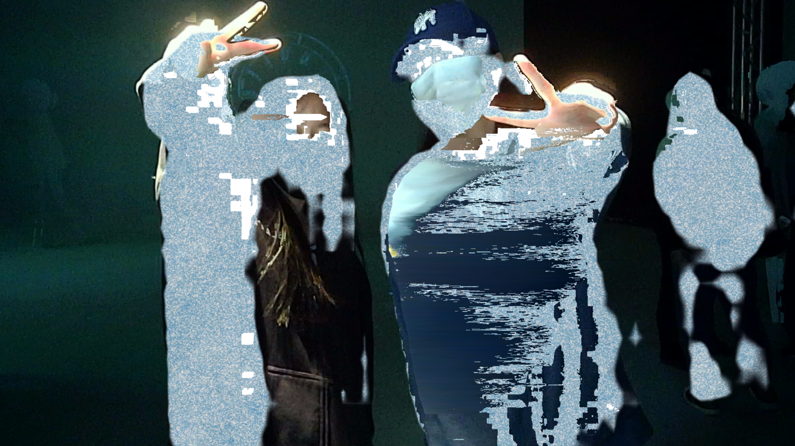

# 🌈 Erin Collaboration – Real-Time AR Style Filter  
*(Interactive AI Photo Studio – 2024)*  

[← Back to main repository](https://github.com/reusahn/Unity-Unreal-Interaction-Research/tree/main)

---

## 🧩 Overview  
**Erin Collaboration** is an interactive AI photo installation that transforms the human figure into the **distinctive animation style of artist Erin** in real time.  
The system detects the subject through segmentation and applies Erin’s painterly, hand-drawn look only to the **person**, while maintaining the **real-world background** unchanged.  

This hybrid rendering process creates a dynamic contrast between **animation and reality**, allowing the participant to step directly into Erin’s visual world.  
Captured portraits are automatically printed through a connected photo printer, turning the installation into a **live AI photo booth** where illustration, technology, and human expression merge.

---

## ⚙️ Technical Description  
- **Engine:** Unity  
- **Framework:** AR Foundation  
- **Software:** Blender · Photoshop  
- **Languages:** C# · Python  
- **AI Framework:** Neural Style Transfer (TensorFlow-trained → ONNX → Unity Barracuda runtime)  
- **Hardware:** PC (NVIDIA RTX 4070 Super), DSLR Camera, Tablet Interface, Photo Printer  

### 🧩 Pipeline  
1. **Dataset Construction & Model Training**  
   - Collected high-resolution stills and animation frames from **Erin’s works** to build a consistent visual dataset.  
   - Trained a **neural style transfer network** using TensorFlow, optimized for Erin’s color tone and texture abstraction.  
   - Exported the model to **ONNX** for real-time inference inside Unity.  
2. **Human Segmentation**  
   - Used **AR Foundation’s Human Stencil Buffer** to precisely isolate the subject.  
   - Applied additional mask dilation and smoothing to maintain natural hair and edge details.  
3. **Stylization Pipeline (Four-Stage Filter Process)**  
   - **Mosaic Filter:** Reduces fine pixel information for painterly brush consistency.  
   - **Pixelation & Contrast Mapping:** Reconstructs edges using dynamic luminance separation.  
   - **Watercolor Noise Filter:** Adds controlled fluid distortion resembling Erin’s brush flow.  
   - **Color Quantization:** Compresses palette range to match Erin’s unique tonal rhythm.  
   - All filters executed via **custom shader graph** chain for minimal latency.  
4. **Real-Time Rendering & Output**  
   - Combined stylized human with live background feed through Unity’s **RenderTexture compositor**.  
   - Achieved **~25–30 FPS** at 1080p with half-precision Barracuda inference.  
5. **Printing & Archive System**  
   - Integrated **photo printer plugin** to instantly generate high-quality prints of captured frames.  
   - Each printed portrait auto-saved with timestamp metadata, creating a growing archive of participants.  

---

## 🧠 Artistic & Research Focus  
This collaboration explores how **AI can extend an artist’s visual language beyond static media**.  
By allowing visitors to inhabit Erin’s distinctive aesthetic in real time, the installation turns **style into a living, generative experience**.  

It investigates the intersection between **artistic authorship and algorithmic interpretation**,  
revealing how noise, texture, and motion can become emotional conduits when machine vision mimics human artistry.  

The printed portraits act as **tangible traces of digital transformation**—proof of the moment when a viewer becomes an artwork.

---

## 🖼️ Media

    
 
    
    

---

## 🎥 Video Documentation

    
  <!--<a href="https://vimeo.com/your-video-link-here" target="_blank">
    -->
  </a>
   

---

## 💻 Implementation Notes  
- **Segmentation:** AR Foundation Human Stencil Buffer  
- **Stylization Runtime:** Unity Barracuda (ONNX Model Inference)  
- **Filter Stages:** Mosaic → Contrast → Watercolor Noise → Color Quantization  
- **Optimization:** Half-precision GPU compute for real-time AR  
- **Output:** 1080p stylized portrait with live photo print system  

---

## 👤 Credits  
**Collaborating Artist:** Erin  
**Technical Director:** Jonghoon Ahn  
**Year:** 2024  
**Institution:** California Institute of the Arts  
**Medium:** Interactive AI Photo Installation  

---

## 🔗 Related  
- [Back to AR-based Style Transfer](../README.md)  
- [View All Projects](https://github.com/reusahn/Unity-Unreal-Interaction-Research/tree/main)
