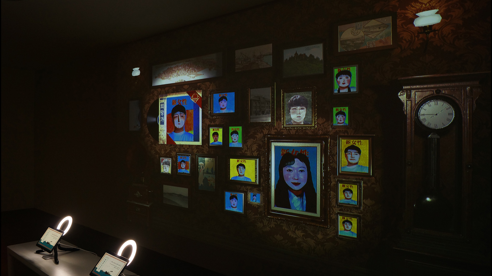
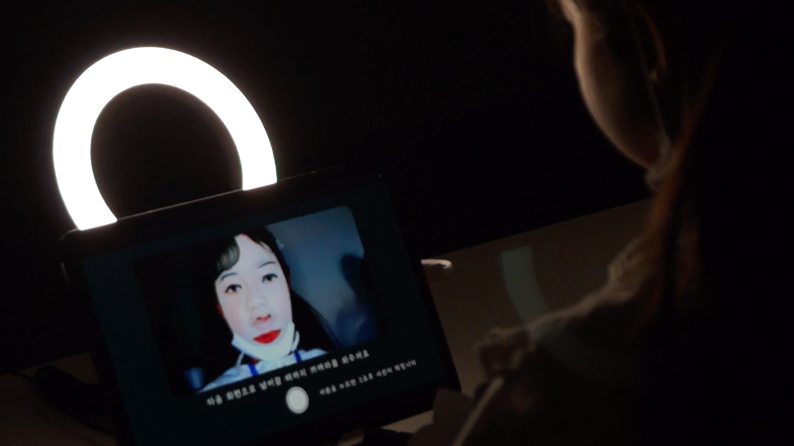
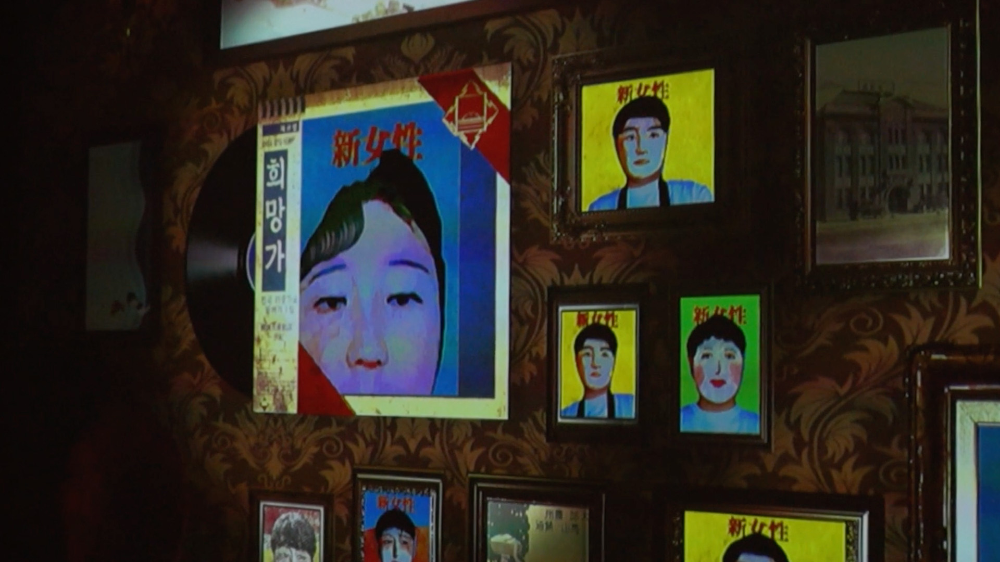

# 📷 Jemulpo Photo Studio  
*(Interactive Media Installation – 2022 · Incheon Metropolitan Museum)*  

[← Back to main repository](https://github.com/reusahn/Unity-Unreal-Interaction-Research/tree/main)

---

## 🧩 Overview  
**Jemulpo Photo Studio** is an interactive media installation that transforms visitors’ live portraits into stylized magazine covers inspired by the **“New Women” (신여성)** aesthetic of early Jemulpo (modern-day Incheon) during Korea’s colonial modernization period.  

Using **AI-based face swapping and real-time style mapping**, the system reimagines participants as figures from early 20th-century Korean visual culture.  
Each transformed portrait is automatically framed and archived in real time, creating a **living wall of digital identities** that merge the past and the present.  

By allowing visitors to step into a virtual photo studio, the work encourages reflection on **modernization, gender, and the historical construction of image and self**.  

---

## ⚙️ Technical Description  
- **Engine:** Unity  
- **Framework:** AR Foundation (camera input, face tracking)  
- **Software:** Photoshop · After Effects (graphic composition and typography)  
- **Languages:** C# · Python  
- **AI Tools:** OpenCV (face detection & alignment) · Unity Barracuda (AI segmentation)  
- **Hardware:** PC (NVIDIA RTX 4070 Super) · DSLR Camera · Display Monitors  
- **Networking:** TCP/UDP-based local server for image archiving and remote display  

### 🧩 Pipeline  
1. **Face Detection & Extension:**  
   Implemented **OpenCV**-based face recognition.  
   Since the original model detected only the facial region, a **custom post-processing algorithm** was developed to expand detection boundaries to include **hair and head contours**, ensuring full stylistic transformation coverage.  

2. **Face Swap & Style Mapping:**  
   Applied **AI-based face swap** using curated “New Women” references.  
   For male participants, artist **Suhyun Yoo** created hybrid *New Woman*-style illustrations, which were integrated into the transformation model.  

3. **Shader-based Style Rendering:**  
   Developed a **custom shader pipeline** combining watercolor, pointillism, and noise-based brush textures.  
   These were layered over the swapped face to emulate the **print texture of 1920s magazines**.  

4. **Segmentation & Background Composition:**  
   Used **Unity Barracuda** to run an ONNX segmentation model that automatically separated the figure from the background.  
   The extracted portrait was composited with **period-accurate magazine layouts**, including typography and framing.  

5. **Archiving & Display:**  
   Each generated image was sent via a **TCP/UDP network server** to a secondary display system,  
   where portraits were continuously added to a **virtual wall of frames** simulating an early photo studio interior.  
   The result was a real-time exhibition that continuously evolved with new participants.  

---

## 🧠 Artistic & Research Focus  
**Jemulpo Photo Studio** reimagines the act of photography as both **cultural reconstruction and interactive storytelling**.  
It explores how **machine learning and historical aesthetics** can intersect to reconstruct **gendered modern identities** in Korean visual history.  

By referencing the **New Women** imagery—symbols of both empowerment and social tension—the installation examines how **image-making** operates as a tool of identity formation across time, technology, and ideology.

---

## 🖼️ Media

    
  

---

## 🎥 Video Documentation

  
   
  <em>Click to view full video on Vimeo</em>

---

## 👤 Credits  
**Artist / Developer:** Jonghoon Ahn  
**Collaborating Illustrator:** Suhyun Yoo  
**Year:** 2022  
**Exhibition:** Incheon Metropolitan Museum  
**Medium:** Interactive Art Installation · AI-based Style Transfer  

---

## 🔗 Related  
- [Back to AR-based Style Transfer](../README.md)  
- [View All Projects](https://github.com/reusahn/Unity-Unreal-Interaction-Research/tree/main)
