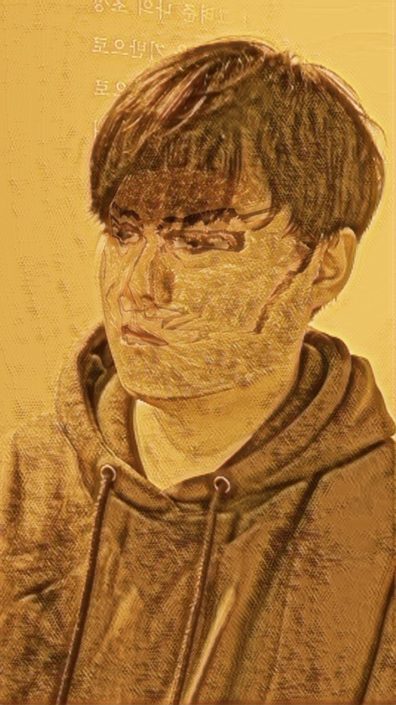
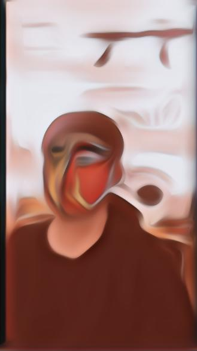
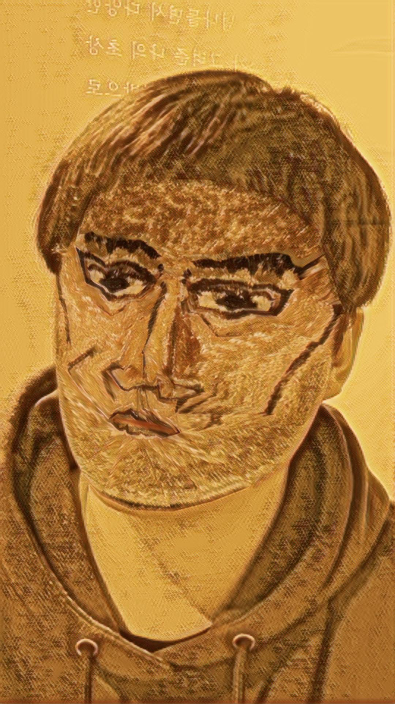
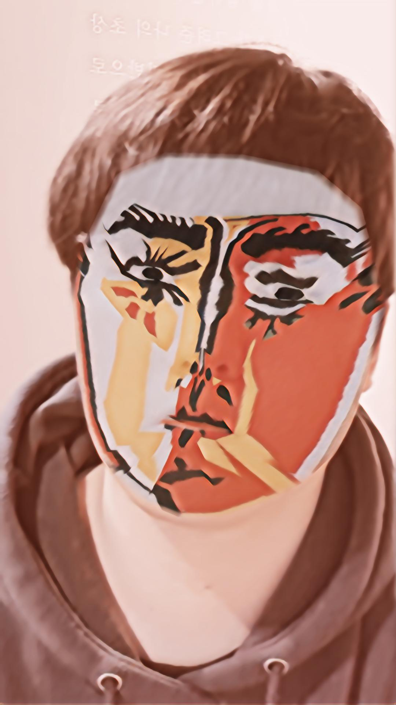
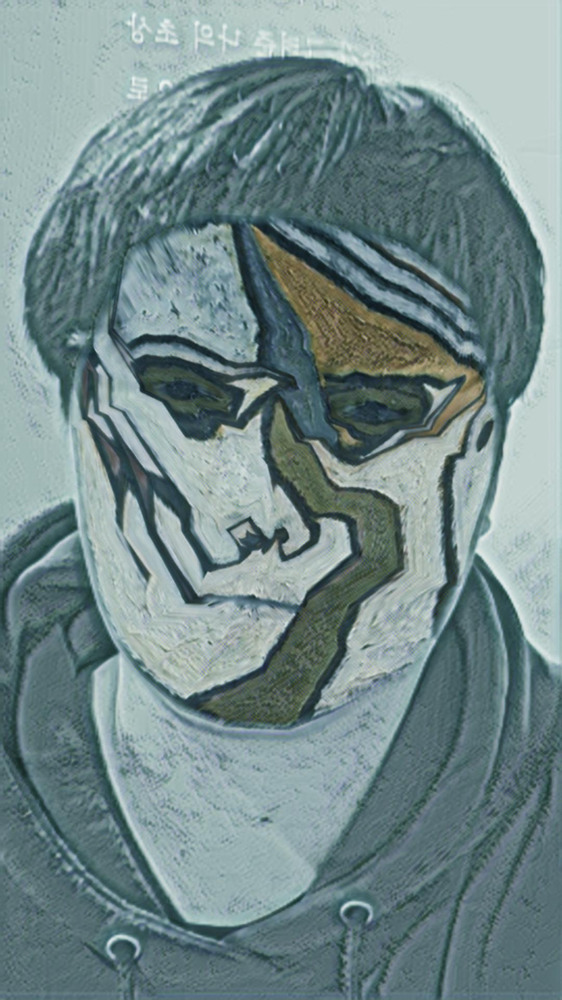
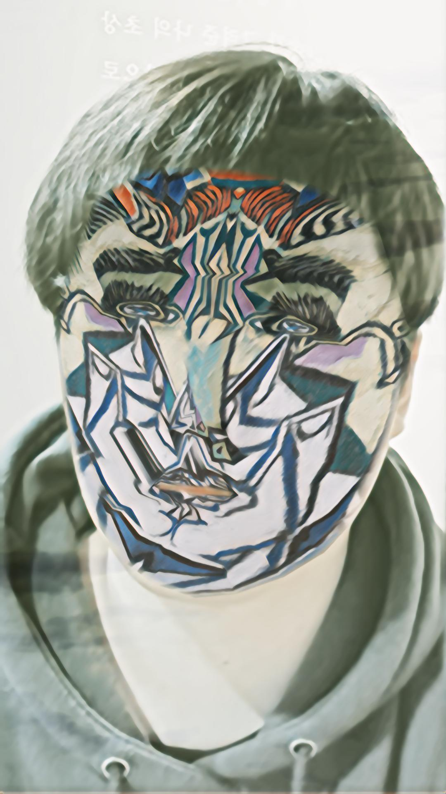

# 🎨 Picasso – AR Self-Portrait Experiment  
*(AR-based Neural Style Transfer Collaboration – 2021 · with Junsoo Ha)*  

[← Back to main repository](https://github.com/reusahn/Unity-Unreal-Interaction-Research/tree/main)

---

## 🧩 Overview  
**Picasso** is an AR-based neural style transfer experiment that reinterprets the human face through the fragmented and abstract aesthetics of **Pablo Picasso’s paintings**.  
Developed in collaboration with **Junsoo Ha**, the work transforms real-time camera input into a **cubist-inspired digital portrait**, turning the viewer’s own image into a living artwork.  

By blending AI training and AR visualization, the project explores how **machine perception redefines identity and authorship**—  
transforming the front-facing camera into both a **mirror and a painter’s brush**.  
Each stylized face is archived on a secondary display, where audience portraits form a collective visual timeline of machine-mediated self-expression.

---

## ⚙️ Technical Description  
- **Engine:** Unity  
- **Framework:** AR Foundation (ARKit)  
- **Software:** Blender · Photoshop (dataset curation)  
- **Languages:** C# · Python  
- **AI Model:** Custom Neural Style Transfer (TensorFlow → ONNX → Unity Barracuda)  
- **Hardware:** iPhone 12 · MacBook Pro (training & deployment)  

### 🧩 Pipeline  
1. **Dataset & Model Training:**  
   Selected **five Picasso paintings** representing distinct cubist and color phases.  
   Trained a neural style transfer model for ~1000 steps using TensorFlow, stabilizing the stylistic balance between abstraction and legibility.  
2. **Model Conversion:**  
   Exported trained model as **ONNX** and executed it in Unity via **Barracuda GPU backend** for real-time inference.  
3. **Real-time Face Capture:**  
   Captured user’s face with **AR Foundation** (WebCamTexture → RenderTexture) and applied live style mapping.  
4. **Network & Archiving:**  
   Used **TCP socket communication** to stream stylized portraits to an external screen,  
   creating a **shared archive** of all captured self-portraits as a looping slideshow.  
5. **Performance Optimization:**  
   Implemented half-precision textures and reduced inference latency to **~20ms per frame**, enabling mobile AR fluency.  

---

## 🧠 Artistic & Research Focus  
The project explores the **intersection of self-perception, artistic style, and neural translation**.  
By training on Picasso’s paintings and applying them to live faces, the work challenges traditional notions of **portraiture and authorship**—  
asking whether a machine can **interpret** rather than merely **replicate** art.  

The archived portraits form a **collective portrait of spectatorship**,  
inviting audiences to see themselves—and each other—through a machine’s reinterpretation of art history.

---

## 🖼️ Media

    
  
       
  
       
  

---
<!--
## 🎥 Video Documentation

  
   
  <em>Click to view full video on Vimeo</em>

-->
---

## 💻 Implementation Notes  
- **Model:** Fast Neural Style Transfer (Johnson et al.)  
- **Runtime:** Unity Barracuda (GPU Compute Shader backend)  
- **Networking:** TCP socket for remote archiving display  
- **Performance:** ~18–22 ms/frame on iPhone 12 (ARKit pipeline)  
- **Output:** Stylized live portrait + remote slideshow archive  

---

## 👤 Credits  
**Artists / Developers:** Jonghoon Ahn & Junsoo Ha  
**Year:** 2021  
**Institution:** Kookmin University  
**Medium:** AR-based Neural Style Transfer Installation  

---

## 🔗 Related  
- [Back to AR-based Style Transfer](../README.md)  
- [View All Projects](https://github.com/reusahn/Unity-Unreal-Interaction-Research/tree/main)
