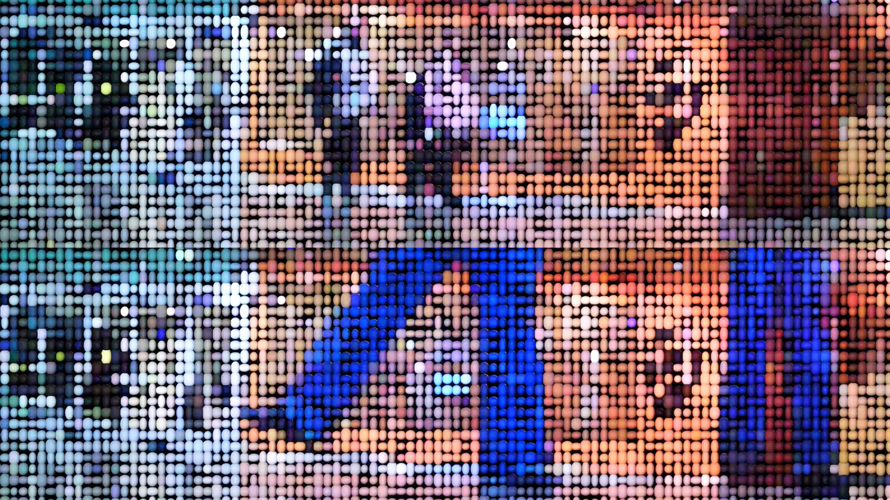

# 🟣 Beads Wall – Motion-Driven Interactive Installation  
*(Media Installation – 2025 · California Institute of the Arts)*  

[← Back to main repository](https://github.com/reusahn/Unity-Unreal-Interaction-Research/tree/main)

---

## 🧩 Overview  
**Beads Wall** is a large-scale media installation that transforms **human motion into abstract visual compositions** made of colorful beads, rendered in real time across four aligned 65-inch displays.  
As viewers pass by, their gestures are detected and reinterpreted as **shimmering pointillist silhouettes**, where movement becomes material and the human form dissolves into vibrant digital particles.  

A **translucent gel diffusion layer** placed in front of the screens adds tactile dimensionality, allowing light from the HDRP-rendered visuals to softly scatter across the surface—  
blurring the boundary between **virtual imagery and physical texture**.  
Through motion, light, and reflection, the piece reimagines human presence as a **living, kinetic digital painting**.  

---

## ⚙️ Technical Description  
- **Engine:** Unity (HDRP)  
- **Language:** C#  
- **Libraries:** OpenCV for Unity  
- **Tools:** VFX Graph · Shader Graph  
- **Hardware:** 4×65" Displays · PC (NVIDIA RTX 4090) · Azure Kinect / High-Resolution Webcam  
- **Pipeline:**  
  1. Capture live motion feed using **OpenCV** for silhouette detection and contour extraction  
  2. Convert binary masks into emitter regions for particle generation  
  3. Use **HDRP + VFX Graph** to render bead particles with physically accurate light scattering  
  4. Map motion velocity and luminance values to color and emissive intensity  
  5. Synchronize particle behavior across four screens for panoramic cohesion  
  6. Add translucent gel medium in front of the display to diffuse projected light and enhance material realism  

---

## 🧠 Artistic & Research Focus  
**Beads Wall** explores how **the human body can become both data and material**, transforming gestures into immersive, light-based compositions.  
By combining **computer vision**, **real-time rendering**, and **material simulation**,  
the installation examines how digital presence and physical tactility can coexist—  
revealing the emotional resonance between **human movement and luminous abstraction**.  

---

## 🖼️ Media

    
  
    

---

## 🎥 Video Documentation

  

---

## 👤 Credits  
**Artist / Developer:** Jonghoon Ahn  
**Year:** 2025  
**Exhibition:** California Institute of the Arts  
**Medium:** Interactive Media Installation (Unity HDRP, OpenCV, VFX Graph)  

---

## 🔗 Related  
- [Back to AR-based Style Transfer](../README.md)  
- [View All Projects](https://github.com/reusahn/Unity-Unreal-Interaction-Research/tree/main)

