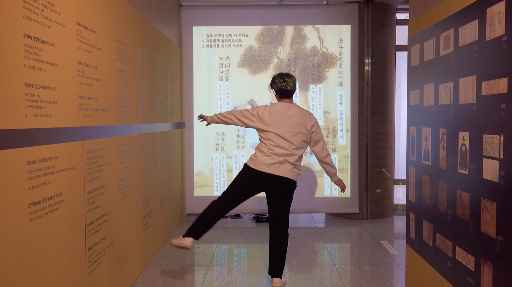
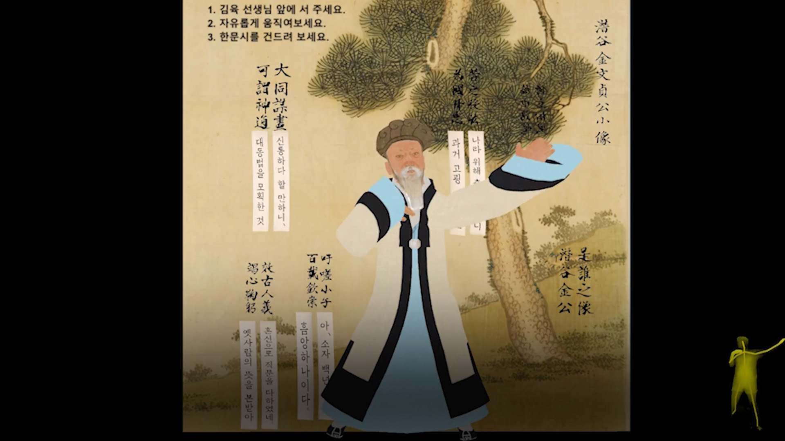
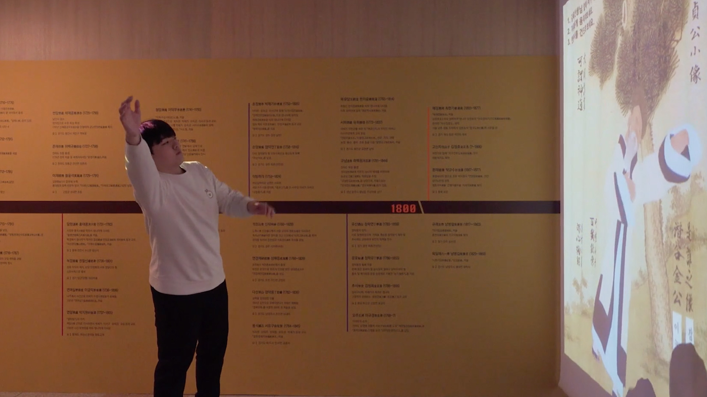

# 🕺 Silhak Dance – Interactive Historical Installation  
*(Interactive Art Project – 2019 · Gyeonggi Silhak Museum)*  

[← Back to main repository](https://github.com/reusahn/Unity-Unreal-Interaction-Research/tree/main)

---

## 🧩 Overview  
**Silhak Dance** is an interactive media installation that brings the **philosophy of Silhak (Practical Learning)** to life through body movement and digital interaction.  
A virtual 3D character of **Kim Yuk**, a key Silhak scholar from the Joseon Dynasty, mirrors the audience’s gestures in real time —  
inviting visitors to “dance” with history while learning about classical Korean thought.  

When the digital Kim Yuk touches floating **Chinese poem texts**, the corresponding **Korean translation** appears instantly,  
bridging past and present through embodied learning.  
The work reimagines historical scholarship as a **playful, interactive educational experience** that combines gesture recognition, language, and animation.

---

## ⚙️ Technical Description  
- **Engine:** Unity  
- **Language:** C#  
- **Hardware:** Kinect v2 · Projection Screen · PC (NVIDIA GTX 1080)  
- **Software:** Maya · Blender  
- **Pipeline:**  
  1. **3D Character Creation**  
     - Modeled and textured the digital figure of *Kim Yuk* in **Maya**, stylized to balance historical realism and interactivity.  
  2. **Rigging & Retargeting**  
     - Retargeted the rig configuration to Unity’s **Humanoid Rig system** for seamless skeletal mapping with Kinect’s body tracking.  
  3. **Motion Interaction**  
     - Used **Microsoft Kinect v2 SDK** to capture real-time skeleton data from the audience.  
     - The data was mapped onto the virtual Kim Yuk, enabling **1:1 motion mirroring** and gesture-based dance triggers.  
  4. **Collider-Based Interaction**  
     - Attached **colliders** to the character’s hands and body parts to detect contact with virtual floating poem objects.  
  5. **Poem Translation System**  
     - When a floating Chinese text object is touched, a **translation event** triggers a Korean version of the poem to appear dynamically on screen.  
  6. **Display & Feedback**  
     - The installation used a **large projection wall** to visualize both the digital scholar and participant’s gestures in synchronized motion.  

---

## 🧠 Artistic & Research Focus  
The project explores how **motion-tracking technology** can turn historical philosophy into **embodied experience**.  
Through physical engagement, visitors interact with classical ideas rather than simply reading them —  
embodying the Silhak principle of *“learning through practice.”*  

By merging **gesture recognition, language, and historical content**, *Silhak Dance* turns the museum into a space of **living education**,  
where the past becomes a responsive digital partner.

---

## 🖼️ Media

    
    
    

---

## 🎥 Video Documentation

  
   
  <em>Click to view full video on Vimeo</em>

---

## 👤 Credits  
**Technical Director:** Jonghoon Ahn  
**Year:** 2019  
**Exhibition:** Gyeonggi Silhak Museum (Yangpyeong, Korea)  
**Medium:** Interactive Motion-Tracking Installation (Kinect v2)  

---

## 🔗 Related  
- [Back to Sensor-based Interaction (Kinect)](../README.md)  
- [View All Projects](https://github.com/reusahn/Unity-Unreal-Interaction-Research/tree/main)
