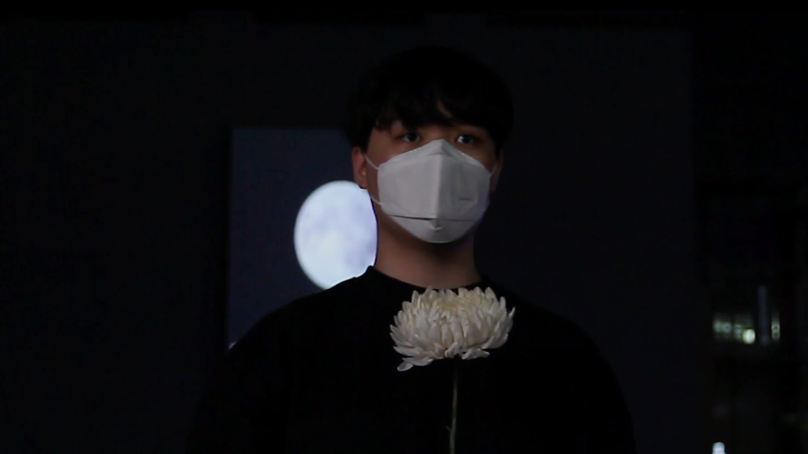

# 🌸 To Eternity – Interactive Memorial Installation  
*(Interactive Art Project – 2020 · Asia Culture Center, Gwangju)*  

[← Back to main repository](https://github.com/reusahn/Unity-Unreal-Interaction-Research/tree/main)

---

## 🧩 Overview  
**To Eternity** is an interactive media installation commemorating the **Gwangju Democratization Movement (May 18, 1980)**.  
Using real-time body recognition, the system transforms the audience’s silhouette into a **living mosaic of historical photographs** collected from the uprising.  

When a participant performs a **flower-offering gesture** and sustains it for more than five seconds,  
the system recognizes the motion and triggers an automatic capture —  
overlaying 300 archival images across the participant’s silhouette to create a **digital memorial portrait**.  

Through this embodied act of remembrance, the work converts silent mourning into a **collective ritual**,  
where technology mediates empathy, presence, and history.

---

## ⚙️ Technical Description  
- **Engine:** Unity  
- **Language:** C#  
- **Hardware:** Azure Kinect · Depth Camera · Projection Screen · PC (NVIDIA RTX 3080)  
- **Software:** OpenCV · TouchDesigner  
- **Dataset:** ~300 archival photographs (May 18 Gwangju Democratization Movement)  
- **Pipeline:**  
  1. **Depth & Skeleton Tracking**  
     - Captured real-time depth and body index maps using **Azure Kinect SDK**.  
     - Extracted joint coordinates to detect upper-body pose patterns.  
  2. **Gesture Recognition System**  
     - Defined a “flower offering” gesture via upper-arm and hand position vectors.  
     - Pose classified as *offering* when confidence exceeded **86%** for **>5 seconds**.  
     - Gesture event triggered **photo capture and mosaic generation**.  
  3. **Archival Image Integration**  
     - Preprocessed ~300 high-resolution documentary images (licensed from participating photojournalists).  
     - Used custom mosaic algorithm in Unity to layer archival photos over the live silhouette in real time.  
  4. **Shader Composition**  
     - Implemented GPU-based blending shader controlling transparency, luminance mapping, and time-based fade-in.  
     - Combined Unity and **TouchDesigner** pipeline for synchronized projection and visual fading.  
  5. **Projection Display**  
     - Final composite projected onto a large wall surface, creating a **memorial altar visualization** that responded to audience participation.  

---

## 🧠 Artistic & Research Focus  
The project transforms **commemoration into participation**, exploring how technology can preserve and reinterpret historical empathy.  
Through gesture, time, and presence, *To Eternity* bridges **personal mourning and collective memory**.  

By allowing the audience’s body to become the **medium of remembrance**,  
it redefines memorial experience as a **collaborative and living archive**,  
where the act of offering flowers becomes a generative visualization of solidarity and resilience.

---

## 🖼️ Media

    
    
    
    

---

## 🎥 Video Documentation

  
   
  <em>Click to view full video on Vimeo</em>

---

## 👤 Credits  
**Technical Director:** Jonghoon Ahn  
**Year:** 2020  
**Exhibition:** Asia Culture Center (ACC), Gwangju  
**Medium:** Interactive Memorial Installation (Azure Kinect, Unity)  

---

## 🔗 Related  
- [Back to Sensor-based Interaction (Azure Kinect)](../README.md)  
- [View All Projects](https://github.com/reusahn/Unity-Unreal-Interaction-Research/tree/main)
