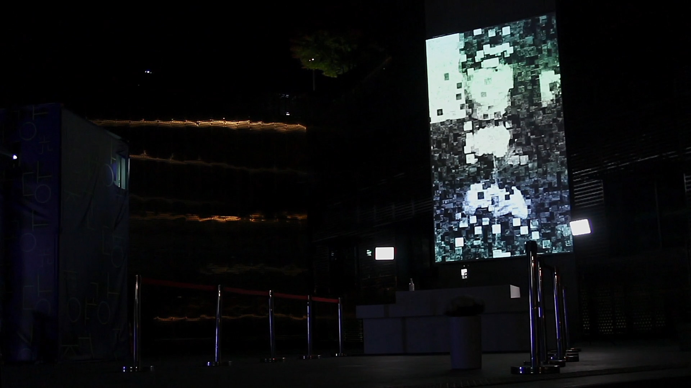

# 🌸 To Eternity – Interactive Memorial Installation  
*(Interactive Art Project – 2020 · Asia Culture Center, Gwangju)*  

[← Back to main repository](https://github.com/reusahn/Unity-Unreal-Interaction-Research/tree/main)

---

## 🧩 Overview  
**To Eternity** is an interactive media art installation commemorating the **Gwangju Democratization Movement (May 18, 1980)**.  
Archival photographs taken during the uprising are algorithmically **mosaicked in real time** over the viewer’s silhouette, transforming remembrance into participation.  

When participants raise their hands or make gestures of **offering flowers**, the system recognizes the movement and completes the evolving mosaic, creating a **digital altar** of shared memory.  
The installation transforms silent mourning into a **collective ritual of tribute**, allowing audiences to engage with history through interaction and presence.  

---

## ⚙️ Technical Description  
- **Engine:** Unity  
- **Language:** C#  
- **Hardware:** Azure Kinect · Depth Camera · Projection Screen · PC (NVIDIA RTX 3080)  
- **Software:** OpenCV · TouchDesigner  
- **Pipeline:**  
  1. Capture real-time depth and body index maps via **Azure Kinect SDK**  
  2. Detect gesture patterns (hands raised, offering motions)  
  3. Overlay archival photographs as live mosaic layers aligned to user silhouettes  
  4. Blend composited image in Unity using custom shader for visual fading and luminance mapping  
  5. Generate evolving image sequences projected as **memorial visualization**  

---

## 🧠 Artistic & Research Focus  
The project transforms **commemoration into interaction**, asking how technology can mediate memory and empathy.  
By engaging the audience’s physical gestures as part of the memorial process, **To Eternity** redefines remembrance not as passive observation but as **embodied participation**.  

It visualizes the convergence of **personal presence and collective history**, where the act of offering becomes both a **ritual and a generative aesthetic process**.  

---

## 🖼️ Media

    
  

---

## 🎥 Video Documentation

  

---

## 👤 Credits  
**Artist / Developer:** Jonghoon Ahn  
**Year:** 2020  
**Exhibition:** Asia Culture Center (ACC), Gwangju  
**Medium:** Interactive Memorial Installation (Azure Kinect, Unity)  

---

## 🔗 Related  
- [Back to Sensor-based Interaction (Azure Kinect)](../README.md)  
- [View All Projects](https://github.com/reusahn/Unity-Unreal-Interaction-Research/tree/main)

