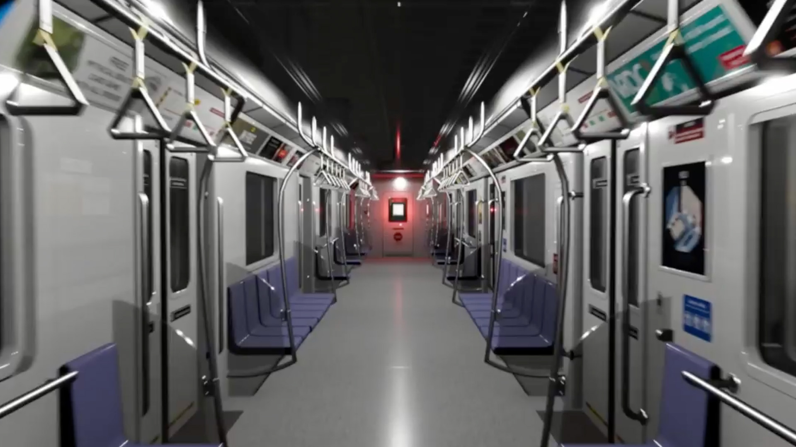

# 🚇 Escape Metro – Surreal VR Escape Game  
*(XR Project – 2024 · Seongsu KAIA Pop-up Store)*  

[← Back to main repository](https://github.com/reusahn/Unity-Unreal-Interaction-Research/tree/main)

---

## 🧩 Overview  
**Escape Metro** is a surreal **VR escape game** set inside an uncanny subway system where players awaken without memory, trapped in an endless loop of tunnels and stations.  
To escape, they must solve spatial puzzles and engage in **real-time dialogue with an in-game AI**, powered by **ChatGPT API**, that questions their choices, motives, and identity.  

The game’s environment distorts familiar architectural logic—  
platforms stretch infinitely, mirrors reflect alternate timelines, and station announcements whisper fragmented memories.  
Through this recursive structure, players confront not only the puzzle of escape, but also the **psychological architecture of control and confinement**.  

---

## ⚙️ Technical Description  
- **Engine:** Unity (XR Interaction Toolkit)  
- **Language:** C#  
- **AI Integration:** OpenAI ChatGPT API (text-to-dialogue system)  
- **Rendering Pipeline:** URP  
- **Hardware:** Meta Quest 2 / Quest Pro  
- **Software:** Blender · Substance Painter  
- **Pipeline:**  
  1. Environment and level design inspired by Seoul subway references  
  2. VR locomotion system (XR Rig with snap-turn + teleport)  
  3. Dialogue system integrated with **ChatGPT API** via WebSocket  
  4. Procedural lighting and sound triggers for psychological immersion  
  5. NFT/Web3 layer for logging user interactions in exhibition context  

---

## 🧠 Artistic & Research Focus  
**Escape Metro** explores themes of **isolation, control, and machine mediation** through immersive space.  
By merging **AI dialogue** with **interactive environment design**, the project turns the escape-room genre into an existential inquiry:  
What does it mean to "escape" when the intelligence guiding you is also the one defining your reality?  

The subway becomes a **metaphor for recursive thought and algorithmic confinement**,  
reflecting how human-AI dialogue loops mirror the structure of the modern digital psyche.  

---

## 🖼️ Media

    
  <!---->

---

## 🎥 Video Documentation

  

---

## 👤 Credits  
**Artist / Developer:** Jonghoon Ahn  
**Year:** 2024  
**Exhibition:** Seongsu KAIA Pop-up Store (Web3 Integrated Showcase)  
**Medium:** VR Game / Interactive AI Narrative Experience  

---

## 🔗 Related  
- [Back to Interactive VR Experience](../README.md)  
- [View All Projects](https://github.com/reusahn/Unity-Unreal-Interaction-Research/tree/main)

