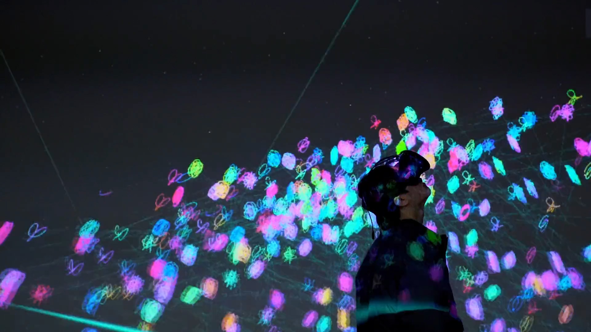
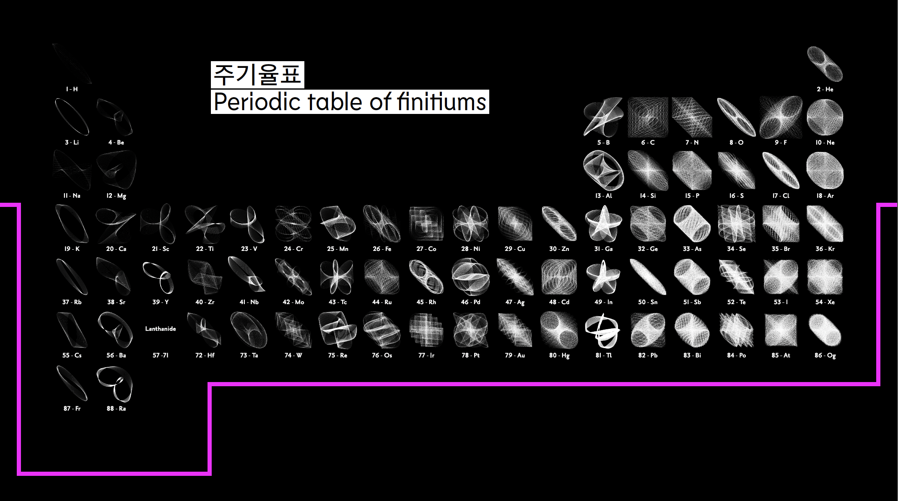

# 🌌 Fineo, Translated Universe – Data Visualization VR  
*(XR Project – 2019 · Grand Prize, 16th Kookmin University Art & Design Exhibition)*  

[← Back to main repository](https://github.com/reusahn/Unity-Unreal-Interaction-Research/tree/main)

---

## 🧩 Overview  
**Fineo, Translated Universe** is a **VR data visualization project** that reimagines the periodic table as a living, harmonic universe.  
Awarded the **Grand Prize** at the 16th Kookmin University Art & Design Exhibition, the project transforms elemental data into **spatial motion and light**, allowing users to experience scientific information as an immersive poetic structure.  

By mapping the atomic values of elements through **harmonograph-based mathematical functions**,  
the installation generates a **new system of visual logic**, where each element becomes a celestial body in a reconstructed digital cosmos.  
The result is a contemplative experience that merges **science, data, and imagination** into a speculative cosmology.  

---

## ⚙️ Technical Description  
- **Engine:** Unity (VR SDK)  
- **Language:** C#  
- **Rendering Pipeline:** Built-in  
- **Hardware:** HTC Vive / Oculus Rift  
- **Software:** Blender · After Effects · Excel (data preprocessing)  
- **Pipeline:**  
  1. Gather elemental data from the periodic table (atomic number, mass, valence)  
  2. Apply harmonograph equations to translate numeric data into spatial coordinates  
  3. Render particle trails and wave patterns corresponding to element properties  
  4. Integrate constellation mapping as secondary visualization layer  
  5. Develop VR navigation system for immersive exploration of the reconstructed cosmos  

---

## 🧠 Artistic & Research Focus  
**Fineo** explores the intersection of **scientific representation and artistic abstraction**,  
inviting participants to perceive the hidden harmony within data.  
By translating raw numerical information into movement, rhythm, and light,  
the project proposes an **aesthetic cosmology of information** —  
where data is not simply measured but **experienced**.  

This work reflects an early inquiry into **data as emotion** and the **translation of logic into form**,  
foreshadowing later experiments in generative systems and human–machine perception.  

---

## 🖼️ Media

    
  

---

## 🎥 Video Documentation

  

---

## 👤 Credits  
**Artist / Developer:** Jonghoon Ahn  
**Year:** 2019  
**Exhibition:** 16th Kookmin University Art & Design Exhibition  
**Award:** Grand Prize Winner  
**Medium:** Data Visualization VR Installation  

---

## 🔗 Related  
- [Back to Interactive VR Experience](../README.md)  
- [View All Projects](https://github.com/reusahn/Unity-Unreal-Interaction-Research/tree/main)

