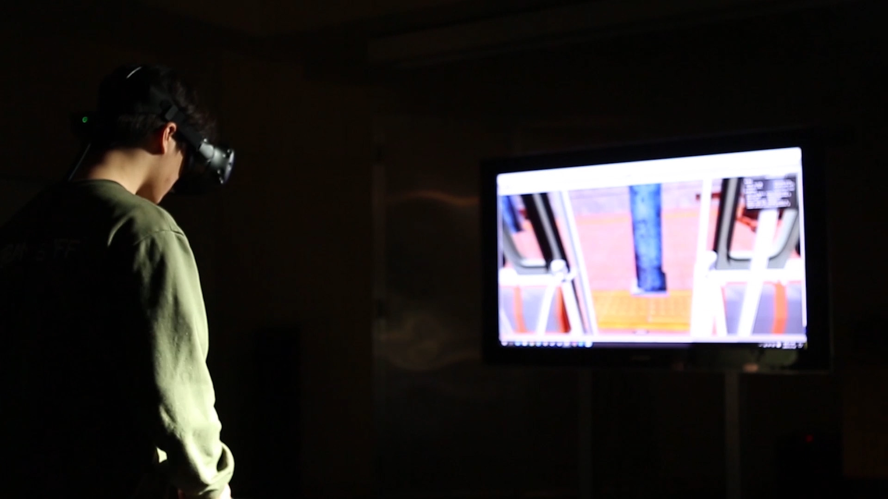

# 🎨 Graffiti Freedom – VR Street Art Experience  
*(XR Project – 2019 · VR Game)*  

[← Back to main repository](https://github.com/reusahn/Unity-Unreal-Interaction-Research/tree/main)

---

## 🧩 Overview  
**Graffiti Freedom** is an experimental **VR experience** that lets players freely spray graffiti inside a virtual subway station—  
reclaiming urban public space **without violating real-world laws**.  

The project combines **street art** with **immersive technology**, transforming a constrained urban site into a canvas of self-expression.  
Within this digital environment, participants confront the boundaries between **legality and creativity**, using virtual spray cans to paint messages of resistance, identity, and hope across the station walls.  

---

## ⚙️ Technical Description  
- **Engine:** Unity (SteamVR / OpenXR)  
- **Language:** C#  
- **Rendering Pipeline:** Built-in  
- **Hardware:** HTC Vive / Oculus Rift  
- **Software:** Blender · Substance Painter  
- **Pipeline:**  
  1. Design of subway-station environment using photogrammetry and PBR materials  
  2. Real-time spray simulation with particle emitters and texture projection  
  3. Controller-based gesture recognition for painting motion  
  4. Save/clear system for graffiti layers on dynamic textures  
  5. Sound and ambient lighting synchronized to motion and paint intensity  

---

## 🧠 Artistic & Research Focus  
**Graffiti Freedom** explores how **virtual reality can extend public expression** beyond physical and legal constraints.  
By situating street art in VR, the work examines the tension between **control and freedom**,  
and how digital tools can serve as instruments of both **rebellion and creation**.  

The subway setting—historically associated with surveillance and transgression—becomes a symbolic stage for reimagining **urban resistance** in the age of simulation.  

---

## 🖼️ Media

    
<!--  -->

---

## 🎥 Video Documentation

  

---

## 👤 Credits  
**Artist / Developer:** Jonghoon Ahn  
**Year:** 2019  
**Medium:** VR Game / Immersive Art Experience  

---

## 🔗 Related  
- [Back to Interactive VR Experience](../README.md)  
- [View All Projects](https://github.com/reusahn/Unity-Unreal-Interaction-Research/tree/main)

