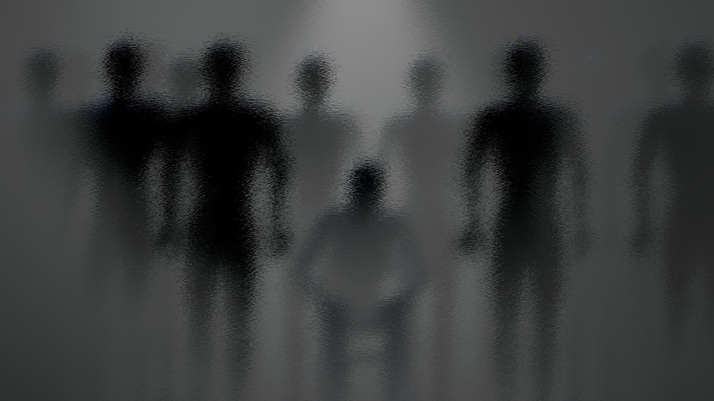
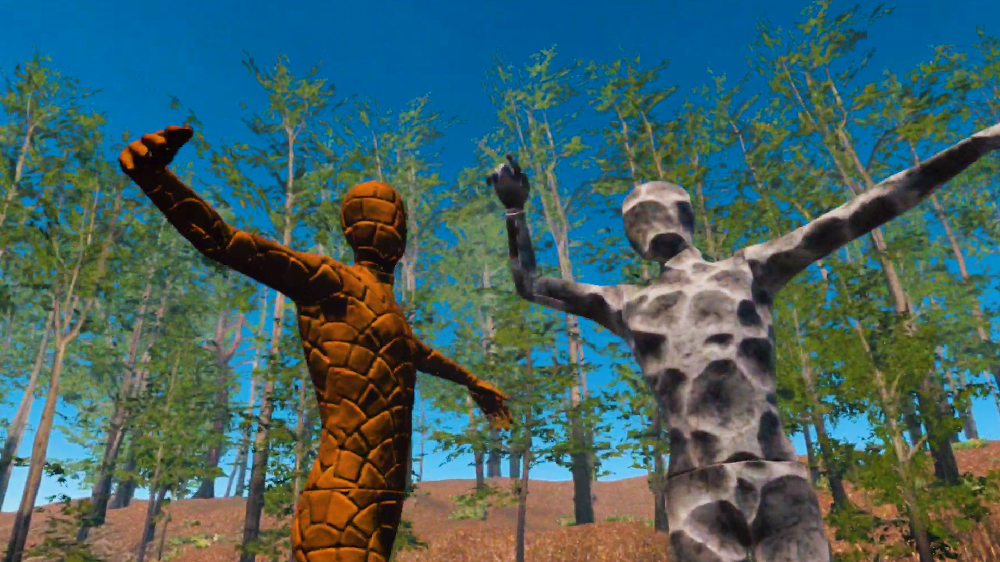

# 🪞 NARCI / Be NARCI – Dual VR Experience on Narcissism  
*(XR Projects – 2023 · The Cave Seoul)*  

[← Back to main repository](https://github.com/reusahn/Unity-Unreal-Interaction-Research/tree/main)

---

## 🧩 Overview  
**NARCI** and **Be NARCI** form a dual VR installation that explores the psychological and emotional mechanics of **narcissism** through two opposing perspectives —  
the **victim** and the **perpetrator**.  

In **NARCI**, the participant is trapped inside a claustrophobic elevator where they encounter a series of narcissistic figures.  
Through **gaslighting-like dialogue and disorienting reflections**, the viewer’s sense of self gradually erodes, mirroring the emotional manipulation of toxic relationships.  
The journey culminates in a moment of **self-confrontation and restoration**, transforming psychological damage into self-recognition and healing.  

In **Be NARCI**, the roles are reversed — the participant becomes the narcissist.  
With each controlling gesture, they **transform graceful human-like beings into frozen statues or metallic debris**, experiencing the seductive illusion of control.  
By embodying both perspectives, the project reveals how **ego, validation, and empathy** intertwine in cycles of power and loss.  

---

## ⚙️ Technical Description  
- **Engine:** Unity (XR Interaction Toolkit)  
- **Language:** C#  
- **Rendering Pipeline:** URP  
- **Hardware:** Meta Quest 2 / Oculus Rift  
- **Software:** Blender · ZBrush · Substance Painter · Adobe Audition  
- **Pipeline:**  
  1. Environment construction and animation in Unity  
  2. Dynamic dialogue and reflection systems for psychological immersion  
  3. Shader-based mirror distortion and depth-of-field control for disorientation  
  4. Interaction mechanics using XR controllers (touch, grip, gaze)  
  5. Physics-based transformation system (rigid-to-static state) for Be NARCI  
  6. Sound spatialization to amplify tension and emotional rhythm  

---

## 🧠 Artistic & Research Focus  
The **NARCI series** investigates how **narcissism functions as both a personal trauma and a social pathology**.  
By immersing participants in conflicting roles—**the manipulated and the manipulator**—the work exposes the emotional architecture of power, control, and dependence.  

Through its duality, the project transforms narcissism from an invisible psychological wound into a **spatial, performative experience**,  
inviting audiences to reflect on empathy, healing, and the act of reclaiming identity in a mediated world.  

---

## 🖼️ Media

    
    
 <!--   
  -->

---

## 🎥 Video Documentation

  
    

---

## 👤 Credits  
**Artist / Developer:** Jonghoon Ahn  
**Year:** 2023  
**Exhibition:** The Cave Seoul  
**Medium:** Dual VR Experience / Interactive Psychological Installation  

---

## 🔗 Related  
- [Back to Interactive VR Experience](../README.md)  
- [View All Projects](https://github.com/reusahn/Unity-Unreal-Interaction-Research/tree/main)

